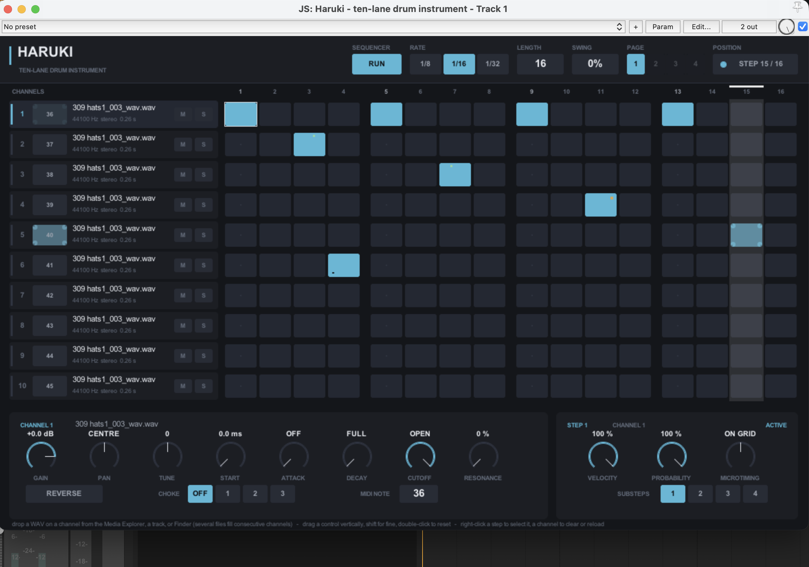

# Haruki — ten-lane drum instrument (REAPER JSFX)

Ten sample channels, a host-synchronised step sequencer with per-step velocity,
probability, substeps and microtiming, and a fixed 1180 × 720 custom interface.

Single file, no dependencies, nothing bundled: `Haruki.jsfx`.

---

## Install

Copy `Haruki.jsfx` into REAPER's effects folder:

| OS      | path                                                    |
|---------|---------------------------------------------------------|
| macOS   | `~/Library/Application Support/REAPER/Effects/Haruki/`  |
| Windows | `%APPDATA%\REAPER\Effects\Haruki\`                      |

Then **FX → add → JS → Haruki**, on a track that receives MIDI.

On this machine the installed effect is a symlink to this folder, so editing
`Haruki.jsfx` here updates the installed plug-in.

No sample folder is needed and none is created. Haruki ships with no samples.

---

## Loading samples

**Drag a WAV onto a channel.** From REAPER's Media Explorer, from a track, or
from Finder. Dropping anywhere on a channel's row — the strip or its steps —
loads that channel. Dropping several files at once fills consecutive channels,
so a whole kit lands in one gesture.

Samples are referenced by absolute path, so they can live anywhere on disk.

**Right-click a channel** for *Clear channel* and *Reload sample*.

There is no file browser inside the window and no "load" dialog, because JSFX
has neither: it has no file-dialog API at all, and a script cannot read a file
slider's list (`strcpy_fromslider` returns REAPER's own current selection and
ignores anything the script writes — measured three ways). Drag-and-drop is the
one native mechanism that works, and it is the one REAPER's own stock `super8`
uses. See `VERIFICATION.md`.

Anything REAPER's media decoders read works: WAV mono/stereo, any standard PCM
bit depth, any sample rate. A file at another sample rate is converted on load,
correct in speed and pitch at Tune 0, and the channel shows `SRC`. A missing
file on project reload keeps the channel's settings and shows `file not found`.

---

## Interface



*Sequencer running on step 15. Green ticks along a cell's top edge are microtiming
(lane 2 late, lane 3 early), the amber dot is probability below 100 %, the tick at
the bottom of lane 6 is a substep, and the dimmer cell on lane 5 is lower velocity.*

```
 header      instrument name · sequencer run · rate · length · swing · page · position
 channels    10 strips: number · pad (shows MIDI note) · filename + format · M · S
 grid        10 lanes × 16 steps, grouped in fours, page-selectable up to 64 steps
 channel     GAIN · PAN · TUNE · START · ATTACK · DECAY · CUTOFF · RESONANCE
             + REVERSE · CHOKE GROUP · MIDI NOTE
 step        VELOCITY · PROBABILITY · MICROTIMING · SUBSTEPS
```

The layout is a fixed coordinate system and never reflows: a larger window shows
more background, a smaller one crops.

| gesture | result |
|---|---|
| drop a WAV on a channel row | load it (several files fill consecutive channels) |
| click a pad | trigger that channel at full velocity |
| click a step | toggle it, and select it for the step editor |
| drag across steps | paint the same on/off state |
| right-click a step | select without toggling |
| right-click a channel | clear / reload menu |
| drag a knob vertically | change value |
| shift + drag | fine adjustment |
| double-click | reset to default |

Step markers inside a cell: fill brightness is velocity, an **amber square** top
right means probability below 100 %, a **green tick along the top edge** is
microtiming (left of centre = early, right = late), and **ticks along the bottom
edge** count substeps.

---

## Controls and defaults

| control | range | default | notes |
|---|---|---|---|
| GAIN | −60 … +12 dB | **0.0 dB** | exactly unity at 0.0 dB |
| PAN | L100 … R100 | **centre** | balance law; unity on both sides at centre |
| TUNE | −24 … +24 st | **0** | shift-drag for cents; 0 uses the direct, non-interpolated path |
| START | 0 … 100 % | **0** | squared mapping, fine near the start; shown in ms |
| ATTACK | OFF … 500 ms | **OFF** | linear ramp. Leftmost is off, so the sample's own transient is untouched |
| DECAY | FULL … 10 ms | **FULL** | exponential to −60 dB. Leftmost is the natural full length; turning right shortens |
| CUTOFF | 20 Hz … OPEN | **OPEN** | 24 dB/oct Moog ladder. Classic direction: left closes, hard right is a true bypass |
| RESONANCE | 0 … 100 % | **0** | maps to the ladder's stable 0…0.85 range |
| REVERSE | off/on | **off** | plays the stored PCM backwards, still uncoloured |
| CHOKE GROUP | OFF, 1, 2, 3 | **OFF** | a trigger in a group fades other voices in that group |
| MIDI NOTE | 0 … 127 | **36 + channel** | channels 1–10 → notes 36–45 |
| VELOCITY (step) | 0 … 100 % | **100 %** | 100 % = unity |
| PROBABILITY (step) | 0 … 100 % | **100 %** | 100 % always fires, 0 % never |
| MICROTIMING (step) | −50 … +50 % of a step | **on grid** | bipolar; shifts the step and any substeps with it |
| SUBSTEPS (step) | 1 … 4 | **1** | evenly spaced inside the step |
| RATE | 1/8, 1/16, 1/32 | **1/16** | |
| LENGTH | 1 … 64 | **16** | any length, including odd ones (7, 12, 31 …) |
| SWING | 0 … 100 % | **0** | delays odd steps by up to half a step |

MIDI is **omni**. Note-on with velocity 0 is treated as note-off. Notes that no
channel is mapped to, and every other MIDI message, are passed through untouched.

A new instance opens with all channels empty and **no steps programmed**.

---

## The filter

24 dB/octave Moog ladder, cutoff and resonance only, no filter envelope. It is
per-voice, so every hit gets a clean filter, and it is skipped entirely by branch
when CUTOFF is at OPEN — which is what keeps the neutral path bit-exact.

The code is REAPER's own stock JSFX `Effects/Liteon/moog24db`, (C) 2008-2009
Lubomir I. Ivanov, GPL, which implements the Moog approximation from the
Stilson/Smith CCRMA paper by way of the CSound source. Because that code is
included, **Haruki as a whole is GPL v2 or later**.

Measured: flat passband, −23.6 dB per octave above cutoff, +7.5 dB resonant lift
at 70 %, stable and bounded. When a resonant voice reaches the end of its sample
the filter tail is flushed (bounded to 4096 samples) rather than cut off.

---

## Sequencer behaviour

Step positions derive from the host timeline (`beat_position` / `tempo`), not a
free-running counter, so start, stop, seek, loop and tempo changes are handled by
construction: the step index is always `floor(beat / step) mod length`. Nothing
accumulates, so nothing can drift.

Events carry sample offsets inside the audio block, so substeps, swing and
microtiming land on exact samples rather than at block boundaries.

**Microtiming** shifts a step by up to ±50 % of a step and carries that step's
substeps with it. The substep span is computed from the swing-only grid, so a
late step followed by an early one cannot collapse or invert the spacing, and the
scheduler scans two steps either side of the block so a shifted event is never
missed.

**Probability** is rolled once per logical step from a hash of (step position,
lane), so it is deterministic for a point on the timeline — an offline render
sounds exactly like playback — while still varying bar to bar.

---

## Audio transparency

At GAIN 0.0 dB, PAN centre, TUNE 0, START 0, ATTACK off, DECAY FULL, CUTOFF OPEN,
REVERSE off and a full-velocity trigger, the per-sample path is:

```
out_l = pcm[n]   * 1.0
out_r = pcm[n+1] * 1.0
```

Interpolation, filter, attack, decay and voice fade are each skipped by branch,
not multiplied by a neutral coefficient. There is no normalisation, saturation,
dithering, DC blocking, limiting or automatic gain compensation anywhere, and no
latency is reported or introduced (no PDC).

Verified against your own drum samples: see `VERIFICATION.md`.

---

## Known JSFX limitations

1. **No file dialog and no in-window file list.** JSFX has neither. Loading is
   drag-and-drop. A drag from REAPER's *FX browser* delivers `@fx:<ident>`
   instead of a path; those are ignored.
2. **The on-screen playhead can run ahead of what you hear.** JSFX sees
   `beat_position` for the block being *processed*, and REAPER renders track FX
   ahead of playback (anticipative FX, on by default) — measured ≈0.25 s. The
   audio is unaffected and sample-exact; only the display leads. Turning off
   anticipative FX in Preferences → Audio → Buffering tightens it.
3. **No HiDPI scaling.** One fixed coordinate system, so on a Retina display
   macOS scales the framebuffer rather than the plug-in drawing at 2×.
4. **Per-channel memory cap** of 1.6 M sample values — about 18 s stereo or 36 s
   mono at 44.1 kHz. A longer file loads as much as fits and the channel is
   marked `TRUNCATED` rather than silently cut.
5. **Loading runs on the audio thread**, because JSFX has no other thread. It is
   chunked (131 072 values per block), and forced to completion in `@block` if a
   trigger for that channel arrives in the same block, so an offline render never
   misses the first hit.
6. **Pattern data is plug-in state, not host automation** — saved with the project
   through `@serialize` rather than consuming 3 200 automation parameters. The 94
   musical parameters (9 per channel plus 4 global) are automatable.

---

## Licence

GPL v2 or later, because the embedded ladder filter is GPL. See the header of
`Haruki.jsfx` for the original attribution.
