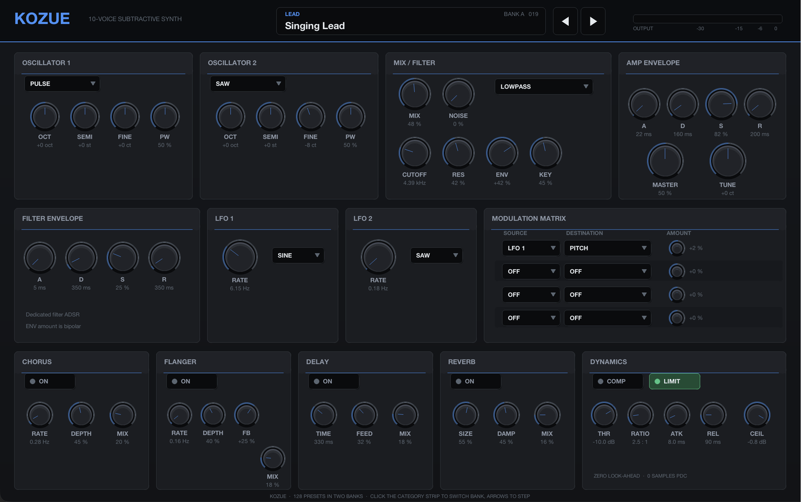
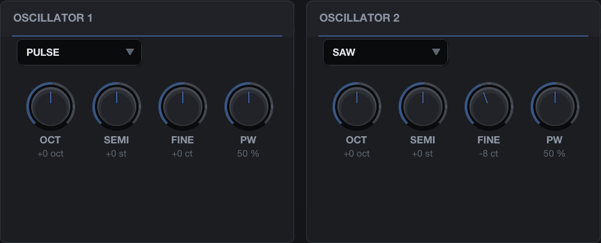
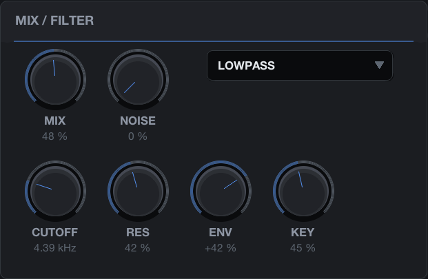
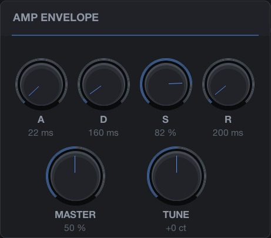
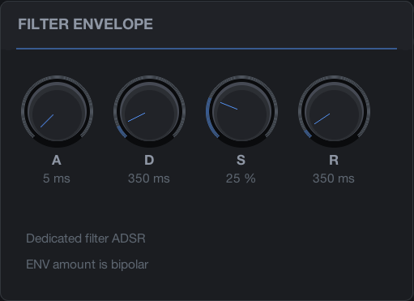
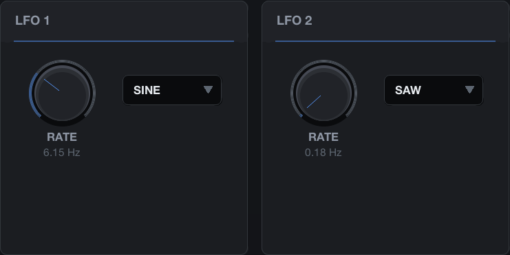
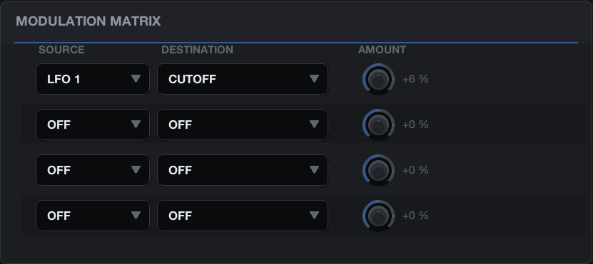
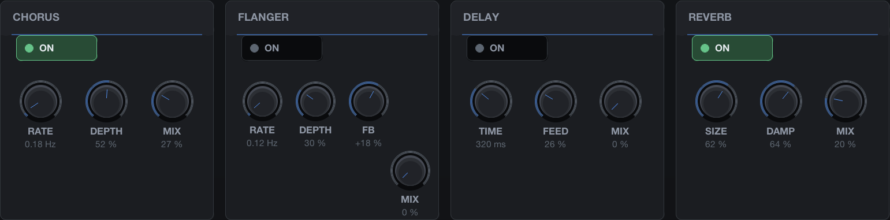
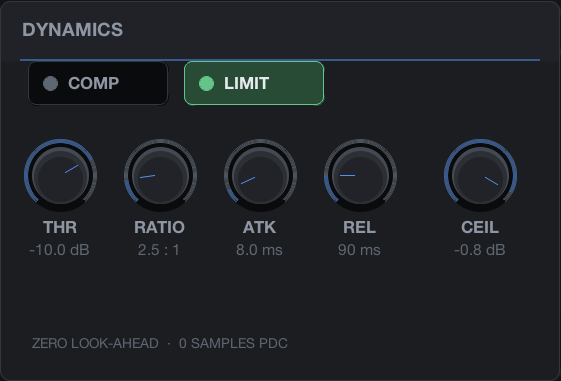

# Kozue — User Manual

Kozue is a ten-voice subtractive synthesizer for REAPER. It is one file, `kozue.jsfx`, with 128
factory presets inside it. This manual has three parts: how to play and program it, how it is
built, and what is known about its provenance.



---

## Part 1 — Playing and programming Kozue

### 1.1 Installing and loading

Copy `kozue.jsfx` into REAPER's `Effects` folder (`~/Library/Application Support/REAPER/Effects`
on macOS) or into a subfolder of it. Open the FX browser on a track, choose **JS: kozue**, and
send the track MIDI from a keyboard or a MIDI item. If the plug-in does not appear, use
*Options → Preferences → Plug-ins → ReaScript / JSFX → re-scan*.

Kozue needs no other files: presets and graphics are all inside the one file. It declares no
latency (0 samples of plug-in delay compensation) and uses no look-ahead.

### 1.2 The window at a glance

The panel is 1100 × 690 design units and shows the whole instrument at once, in signal order.
On a Retina display it is drawn at double resolution.

| Row | Panels |
|---|---|
| Header | Name, preset display with category and bank, previous/next arrows, output meter |
| 1 | OSCILLATOR 1, OSCILLATOR 2, MIX / FILTER, AMP ENVELOPE (with MASTER and TUNE) |
| 2 | FILTER ENVELOPE, LFO 1, LFO 2, MODULATION MATRIX |
| 3 | CHORUS, FLANGER, DELAY, REVERB, DYNAMICS |

**Working the controls**

- Drag a knob **up or down** to change it. The full range of a knob is about 170 pixels of
  travel, so a small movement makes a small change.
- Every knob shows its **name and its current value** in real units underneath: Hz or kHz for
  cutoff, ms or s for times, dB for thresholds and ceilings, cents and semitones for tuning,
  percent for mixes, depths and amounts. The value turns blue while the pointer is over the knob.
- Boxes with a small triangle are **selectors**: each click steps to the next option (wave shape,
  filter type, LFO shape, modulation source and destination). They wrap around.
- **ON** buttons and the COMP / LIMIT buttons are toggles; the dot lights green when on.
- The output meter in the header shows the peak of the last few frames on a 60 dB scale, with
  −30, −15, −6 and 0 dBFS marked.

Every control is also a REAPER parameter, so it can be automated with envelopes, mapped to a
controller with *Param → Learn*, and it is saved with the project.

### 1.3 Presets and banks


The header shows the **category** of the current preset in small capitals, its **name**, and at
the right of the strip the **bank letter and the preset number** (0–127).

- **◀ ▶** step to the previous or next preset through the whole library, from 0 to 127.
- **Click the category strip** (the upper part of the preset box) to switch bank: it jumps to
  the same slot in the other bank, so slot 5 of bank A becomes slot 5 of bank B and back.
- In REAPER's parameter list the same two things are the **Patch** slider (0–79) and the
  **Library bank** switch (Original / Extended). Bank B holds 48 presets, so with the bank set
  to Extended the patch slider only reaches 47.

Loading a preset resets every sound control and silences any sounding notes. Your own edits are
kept in the project: Kozue stores the loaded preset and all 67 sound parameters with the track,
and restores them when the project is reopened instead of reloading the factory values. To keep
a sound outside a project, save it as a REAPER FX preset (the **+** button in the FX window).

Kozue does not respond to MIDI program change; select presets with the arrows, the parameter
list, or automation of the Patch and Library bank parameters.

**Bank A (0–79)**

| Category | Presets |
|---|---|
| Bass 0–15 | Sub Foundation, Rubber Bass, Acid Pulse, Deep Square, Neon Bass, Round Saw, Dry Funk Bass, Wide Bass, Dark Sub, Pluck Bass, Reso Bass, Electro Bass, Soft Bass, Dirty Pulse, Night Bass, Solid Low |
| Lead 16–31 | Clean Lead, Bright Saw Lead, Pulse Lead, Singing Lead, Glass Lead, Analog Solo, Soft Square Lead, Neon Lead, Reso Lead, Air Lead, Chorus Lead, Delayed Lead, Narrow Lead, Wide Solo, Cutting Lead, Velvet Lead |
| Keys 32–47 | Soft Keys, Electric Keys, Digital EP, Pluck Keys, Bright Keys, Mellow Keys, Chorus Keys, Bellish Keys, LoFi Keys, Organish Keys, Perc Keys, Wide Keys, Nocturne Keys, Soft Clav, Glass Keys, Studio Keys |
| Pad 48–63 | Warm Pad, Slow Air, Analog Bed, Blue Pad, Wide Strings, Soft Choir, Drift Pad, Dark Pad, Cloud Pad, Motion Pad, Chorus Pad, Deep Space, Velvet Pad, Frozen Pad, Sunrise Pad, Night Wash |
| FX 64–79 | Noise Rise, Filter Sweep, SciFi Pulse, Wind Field, Dark Drone, Signal Ping, Space Dust, Reso Drift, Machine Bed, Ghost Tone, Orbit FX, Underwater, Static Bloom, Alarm Texture, Long Fall, Void Layer |

**Bank B — the extended 48 (80–127)**

| # | Name | Character |
|---:|---|---|
| 80 | Weight of One | Pure sub plus a restrained octave triangle; a dry, centred low-register foundation |
| 81 | Copper Finger | Narrow-pulse finger articulation with a short saw edge; syncopated bass lines |
| 82 | Elastic Octave | Square body over a sine sub with a slower, rounded filter fall |
| 83 | Sawtooth Anchor | Tightly detuned saw pair with a firm low end; broad but mono-compatible |
| 84 | Hollow Foot | Triangle fundamental and muted pulse colour with a closing filter scoop |
| 85 | Clickless Dub | Soft sine-triangle weight with rounded note boundaries; dub pulses and long low notes |
| 86 | Sequence Wire | Short bright pulse over a sine floor; sequenced patterns with almost no sustain |
| 87 | Fifth Pressure | A quiet sine fifth reinforces a saw bass without low-end beating; power ostinatos |
| 88 | Silk Line | Sine-triangle singing lead with a subtle 6 Hz vibrato; lyrical single-note phrases |
| 89 | Lantern Solo | Detuned saw lead with a rounded attack and a restrained stereo chorus |
| 90 | Narrow Ribbon | Two different narrow pulses give a nasal, bright ribbon above the bass register |
| 91 | Octave Beacon | A pure main tone with a bright upper square octave; clear melody in dense mixes |
| 92 | Hollow Reedline | Key-tracked band-pass triangle-square reed; a contained midrange voice |
| 93 | Syncopated Glow | Warm saw-pulse melody with audible tremolo and a short offset echo |
| 94 | Fifth Glint | Triangle melody with a restrained sine fifth and a gentle moving image |
| 95 | Air Column | Soft triangle-sine lead with a trace of breath noise; rounded upper-register lines |
| 96 | Ink Tines | Triangle body and upper sine octave with a long decaying strike; electric-key chords |
| 97 | Reed Stack | Square-pulse pair with firm sustain and slow chorus; chord stabs or held harmony |
| 98 | Paper Hammer | Saw-triangle strike that darkens quickly; dry percussive comping |
| 99 | Soft Drawbar | Two pure octave drawbars with near-flat sustain; soft organ-like harmony |
| 100 | Amber Wurble | Pulse strike supported by a quiet lower triangle; warm keys with soft tremolo |
| 101 | Frost Chimes | Two sine partials an octave and an octave-plus-fifth up; tuned chimes with open decay |
| 102 | Electric Quill | Dry narrow pulse and square pick; short, bright rhythmic comping |
| 103 | Velvet Comp | Mellow saw-triangle keys with a slightly rounded attack; jazz-like voicings |
| 104 | Cedar Interval | Warm detuned saw ensemble with gradual brightness; general-purpose sustained chords |
| 105 | Porcelain Veil | Pure lower sine with a soft upper triangle; slow luminous harmony |
| 106 | Rainline | Band-pass saw/triangle and filtered air noise; an airy moving layer |
| 107 | Low Horizon | Centred triangle with a restrained sine sub; a dark supporting pad |
| 108 | Breathing Glass | Sine body and upper square shimmer with a slow triangle-shaped filter breath |
| 109 | Threaded Fifth | A saw body threaded with a quiet triangle fifth; slow parallel harmony with pitch drift |
| 110 | Smoke Chamber | Nasal pulse/noise band-pass cloud that leaves space for bass and treble |
| 111 | Wide Current | Unequal pulse widths and slow detune give a broad flowing ensemble |
| 112 | Felt Droplet | Soft sine/upper-triangle droplet with a short room tail; gentle ostinatos |
| 113 | Bronze Pick | Fast saw-pulse pick with an upper octave and a faint noise edge; sharp arpeggios |
| 114 | Rubber Mallet | Two sine octaves with a soft onset and a short dark decay; mallet ostinatos |
| 115 | Prism Arp | Bright square with an upper triangle and a resonant filter snap; electronic arpeggios |
| 116 | Wooden Signal | Band-pass triangle and octave-plus-fifth square partial; short hollow percussion |
| 117 | Circuit Pin | Very narrow pulse with a filtered sine support; tiny dry high-passed ticks |
| 118 | Droplet Fifth | Sine and restrained triangle fifth with a lingering echo; sparse tuned droplets |
| 119 | Copper Harp | Filtered saw plus upper sine octave with a longer decaying body; harp-like patterns |
| 120 | Golden Section | Saw-square synth brass with a short blooming filter attack; punchy stabs |
| 121 | Muted Alloy | Warm muted pulse-saw brass with a compact nasal body; softer stabs |
| 122 | Octave Fanfare | Dry stacked saw octaves with an assertive filter bloom; bright unison fanfares |
| 123 | Breathing Horns | Triangle-pulse ensemble with a slower filter swell; rounded sustained brass |
| 124 | Clockwork Chord | Held saw-pulse chords under a rounded square-LFO tremolo; 4 Hz accompaniment |
| 125 | Orbit Lace | Light triangle-pulse texture with slow panning and independent filter motion |
| 126 | Tidal Sweep | Detuned saws through a slowly sweeping resonant band-pass; an evolving motion layer |
| 127 | Dual Meter | Pulse-saw texture with independent 3.2 Hz amplitude and 4.8 Hz brightness cycles |

Every preset's master level was set by measurement so that the library browses evenly: a
sustained note and a triad were rendered for all 128 sounds and compared with a K-weighted
loudness measure, categories were placed on a common scale (pads 3 dB and effects 4 dB below
basses and leads), and no preset reaches −3 dBFS in ordinary playing. The ten-voice limit and the
output limiter still protect the extreme case of a full ten-note cluster at high velocity.

### 1.4 Oscillators



Each voice has two oscillators with the same controls:

| Control | Range | What it does |
|---|---|---|
| Wave selector | SINE, SAW, SQUARE, TRI, PULSE | The waveform. SAW, SQUARE and PULSE are band-limited (PolyBLEP); TRI has corner smoothing (PolyBLAMP); SINE is pure |
| OCT | −2 … +2 | Octave offset |
| SEMI | −12 … +12 | Semitone offset |
| FINE | −50 … +50 ct | Fine tuning in cents |
| PW | 5 … 95 % | Pulse width, used by the PULSE wave only. SQUARE is always 50 %. The pulse's DC component is removed, so narrow widths do not shift the signal |

SQUARE and PULSE differ only in that PULSE reads the PW knob. Detuning the two oscillators by a
few cents (FINE) is the usual way to thicken a sound; an octave or a fifth on oscillator 2 is
the usual way to add weight or colour.

### 1.5 Mix, noise and filter



| Control | Range | What it does |
|---|---|---|
| MIX | 0 … 100 % | Crossfade between oscillator 1 (0 %) and oscillator 2 (100 %) |
| NOISE | 0 … 100 % | Adds white noise, per voice, in place of part of the oscillator signal |
| Filter type | LOWPASS, BANDPASS, HIGHPASS | The mode of the state-variable filter. BANDPASS is level-compensated so it does not get louder with resonance |
| CUTOFF | 30 Hz … 18 kHz | Filter frequency before modulation. The effective cutoff is limited to 42 % of the sample rate |
| RES | 0 … 95 % | Resonance. The filter is stable at every setting; at high resonance the output is slightly attenuated to keep the level in hand |
| ENV | −100 … +100 % | How much the filter envelope moves the cutoff: up to ±4 octaves at full amount |
| KEY | 0 … 100 % | Keyboard tracking. At 100 % the cutoff follows the played note one-to-one, centred on middle C |

The filter is one 12 dB/octave state-variable filter per voice, solved with the trapezoidal
(zero-delay-feedback) method, so it stays stable at high cutoff and low damping where a plain
Chamberlin design would run away.

### 1.6 Envelopes

 

Two ADSR envelopes per voice, one for the amplifier and one for the filter cutoff. Both are
exponential (analogue-style curves).

| Control | Range | Notes |
|---|---|---|
| A | 0 … 5 s | Attack. Zero gives the fastest attack the engine allows (about 1 ms) |
| D | 0 … 5 s | Decay to the sustain level |
| S | 0 … 100 % | Sustain level |
| R | 5 ms … 8 s | Release. A voice is freed when its level falls below −76 dB |

The times are nominal: the curves are exponential, so the audible attack takes about one and a
half times the labelled value and the release about twice it.

The AMP ENVELOPE panel also holds **MASTER** (0–100 %, the output level of the instrument, set per
preset) and **TUNE** (±100 cents, master tuning).

**Velocity** controls the level of each note with a medium curve: velocity 127 is full level,
velocity 64 is about −9 dB, velocity 32 about −18 dB. Velocity does not change the timbre by
itself; use the filter envelope and the filter's KEY control for brightness that follows the
keyboard.

### 1.7 LFOs



Two global, free-running LFOs. Each has a **RATE** (0.03–20 Hz) and a shape selector (SINE,
SAW, SQUARE, TRI). They do nothing on their own: they become audible when they are chosen as a
source in the modulation matrix. Both LFOs are shared by all voices, so a vibrato is the same on
every note.

### 1.8 The modulation matrix



Four rows, each a **source**, a **destination** and a bipolar **amount** (−100 … +100 %). Rows
that target the same destination add up.

| Source | Value |
|---|---|
| OFF | Nothing |
| LFO 1, LFO 2 | −1 … +1 |
| MODWHL | The modulation wheel (CC 1), mapped from 0–127 to −1 … +1. At rest the wheel is −1, so a positive amount lowers the destination until the wheel is moved |

| Destination | Effect at full amount |
|---|---|
| PITCH | ±3 semitones |
| OSC MIX | ±45 % of the crossfade |
| CUTOFF | ±3 octaves |
| RESONANCE | ±42 % |
| AMP | Level ×1 ± 0.75 (tremolo) |
| PAN | Stereo position, ±75 % |
| CHOR DEPTH, CHOR MIX | Chorus depth ±55 %, mix ±45 % |
| FLNG DEPTH, FLNG MIX | Flanger depth ±55 %, mix ±45 % |
| DLY TIME, DLY FEED, DLY MIX | Delay time ±35 %, feedback ±28 %, mix ±45 % |
| REV SIZE, REV MIX | Reverb size ±45 %, mix ±45 % |
| COMP THR | Compressor threshold ±12 dB |
| LIM CEIL | Limiter ceiling ±6 dB |

Modulation values are smoothed with a 1.5 ms time constant, so square and saw LFOs into pitch or
cutoff step cleanly instead of clicking.

### 1.9 Effects



The effects run in series after the voices are summed: chorus → flanger → delay → reverb →
compressor → DC removal and master level → limiter. Each effect has an **ON** button; a bypassed
effect costs nothing, and its buffers are cleared so re-enabling it never plays back stale audio.

| Effect | Controls | Notes |
|---|---|---|
| CHORUS | RATE 0.03–5 Hz, DEPTH, MIX | Two modulated delays (8–18 ms) in quadrature, one per channel: the usual stereo widening |
| FLANGER | RATE 0.03–5 Hz, DEPTH, FB −90 … +90 %, MIX | Short modulated delay (0.35–4.15 ms) with feedback; the right channel is offset by 7 % for width |
| DELAY | TIME 20–1000 ms, FEED 0–92 %, MIX | Stereo delay with cross-channel feedback; the right channel runs 0.3 % longer so repeats spread |
| REVERB | SIZE, DAMP, MIX | Multi-tap feedback network with two diffusion stages and high-frequency damping in the loop |



| Section | Controls | Notes |
|---|---|---|
| COMP | THR −36 … 0 dB, RATIO 1 … 12, ATK 0.2–100 ms, REL 10–500 ms | Stereo-linked peak compressor without make-up gain. Off in every factory preset so velocity dynamics survive; switch it on when you want a squashed sound |
| LIMIT | CEIL −12 … 0 dB | Zero-look-ahead peak guard applied to both channels equally, 60 ms release. It only engages when a dense chord exceeds the ceiling; factory levels keep it idle in normal playing |

A 5 Hz DC blocker sits before the master level, so narrow pulses and sub tones never leave an
offset on the output.

### 1.10 MIDI

- **Polyphony** is ten voices. An eleventh note takes the oldest held voice, after any released
  voice, and the stolen voice is faded over 3 ms so the steal does not click.
- **Note timing** is sample-accurate: notes start on the exact sample REAPER schedules, not at
  the start of the audio block.
- **Sustain** (CC 64) is per channel: notes released while the pedal is down keep sounding until
  it is lifted.
- **Pitch bend** is ±2 semitones, per channel.
- **Modulation wheel** (CC 1) is a matrix source (see 1.8).
- **CC 120** (all sound off) silences a channel immediately; **CC 123** (all notes off) releases
  it; **CC 121** (reset controllers) clears the pedal, bend and wheel.
- Stopping the transport releases every voice, so nothing hangs after a loop.
- Messages Kozue does not use (program change, aftertouch, other CCs) are passed through to the
  next plug-in.

### 1.11 Recipes

- **A fatter lead**: set both oscillators to SAW, FINE +4 on one and −4 on the other, MIX 50 %,
  CUTOFF around 3 kHz with ENV +25 %, and a little CHORUS at 15 % mix.
- **Vibrato**: LFO 1 SINE at 5.5 Hz → PITCH at +2 %. The modulation wheel cannot scale an LFO
  (there is no LFO-depth destination), so keep vibrato fixed and give the wheel something of its
  own, such as MODWHL → CUTOFF at +40 %: the sound is darkest with the wheel down and opens as
  it rises. Use a negative amount for the opposite.
- **Sidechain-free pumping**: LFO 2 SQUARE at the tempo's quarter-note rate (2 Hz at 120 BPM) →
  AMP at −60 %.
- **Auto-wah keys**: a Keys preset with matrix LFO 1 (0.5 Hz, TRI) → CUTOFF at +30 % and RES at
  40 %.
- **Sub bass that stays clean**: SINE on both oscillators, oscillator 2 an octave down, filter
  LOWPASS at 400 Hz, RES 0, no effects, and let the DC blocker and limiter do nothing.

---

## Part 2 — How Kozue is built

### 2.1 One file, two threads of work

`kozue.jsfx` is a REAPER JSFX effect written in EEL2. The audio sections (`@init`, `@slider`,
`@block`, `@sample`, `@serialize`) run on REAPER's audio thread; the interface (`@gfx`) runs on
the UI thread at 30 frames per second and talks to the engine only through the slider values, a
one-word preset request and the peak meter.

### 2.2 Voices and rendering

Ten voice slots, 32 memory cells each, are rendered voice by voice inside `@sample`. MIDI is
collected in `@block` into a queue with sample offsets and dispatched in `@sample` when the
running position reaches each event. Voice allocation prefers an idle slot, then the quietest
released voice, then the oldest held one; the stolen voice's last output is faded out over 3 ms.

Continuous controls are smoothed with a 5 ms one-pole filter before they reach the voices, so
automation and knob movement never click. Envelope coefficients are cached and refreshed every
16 samples.

### 2.3 Oscillators

Phase accumulators per oscillator. SAW and SQUARE/PULSE use PolyBLEP correction at their
discontinuities; TRI uses an integrated correction (PolyBLAMP) at its corners; PULSE subtracts
its own DC so the width control does not move the signal's average. Noise is a per-voice linear
congruential generator seeded from the note, channel and note count, so a render is
reproducible.

### 2.4 Filter

A trapezoidal-integrator state-variable filter (the topology-preserving form) with damping
`1.98 − 1.82 × resonance`, cutoff limited to 42 % of the sample rate. It is stable everywhere in
its range, where the simpler Chamberlin recurrence diverges at high cutoff and low damping.

### 2.5 Effects and output

Chorus and flanger are modulated fractional delays with linear interpolation; the delay has
cross-channel feedback; the reverb is four early taps per channel into a damped feedback loop
with two all-pass diffusion stages. The compressor is a peak-envelope design without make-up.
The output stage is a 5 Hz DC blocker, the master level, and a stereo-linked zero-look-ahead peak
guard with 60 ms release. Denormals are flushed. There is no oversampling and no look-ahead.

### 2.6 State

REAPER saves every slider with the project. Kozue additionally serializes the loaded preset and
all 67 sound parameters, and restores them on the first audio block after loading; this is what
makes edited sounds survive a project reload, because REAPER applies the preset slider before it
hands the saved state back to the plug-in.

### 2.7 Cost

Measured in an offline host at 48 kHz with ten voices, chorus and reverb: about 13 % of one core
including measurement overhead; a typical single preset renders at around 7 %. In REAPER an idle
instance shows about 3 % on the CPU meter. Memory use is fixed at about 2.3 million cells.

### 2.8 How it was verified

- All sections compile in an independent EEL2 host, and a static checker finds no unassigned
  identifiers.
- A 14-point MIDI and state protocol passes: note-on and note-off at the exact sample offset,
  ten voices, oldest-held stealing, channel-scoped sustain, overlapping same-note release,
  velocity-zero note-off, channel-scoped pitch bend, CC 120 and 123, save and restore of edited
  values including the high sliders, bank mapping, zero declared latency.
- All 128 presets were rendered through the same 24-second MIDI schedule (single notes at three
  velocities, repeats, legato, a triad, extreme registers, bend, pedal, a ten-voice cluster and a
  release tail): no non-finite sample, no filter-state growth, no audio before the first note, no
  clipping, no ringing tail.
- In REAPER 7.79 on macOS: the file loads without error, exposes 72 parameters, switches banks,
  renders the same audio as the offline host to within 0.5 dB in every measured window, and
  keeps edited values across save and reload.

---

## Part 3 — Provenance

### 3.1 Licence

Kozue is released under the **MIT License**. The full text is also embedded at the end of
`kozue.jsfx`:

```
MIT License

Copyright (c) 2026 Michele Ibba

Permission is hereby granted, free of charge, to any person obtaining a copy
of this software and associated documentation files (the "Software"), to deal
in the Software without restriction, including without limitation the rights
to use, copy, modify, merge, publish, distribute, sublicense, and/or sell
copies of the Software, and to permit persons to whom the Software is
furnished to do so, subject to the following conditions:

The above copyright notice and this permission notice shall be included in
all copies or substantial portions of the Software.

THE SOFTWARE IS PROVIDED "AS IS", WITHOUT WARRANTY OF ANY KIND, EXPRESS OR
IMPLIED, INCLUDING BUT NOT LIMITED TO THE WARRANTIES OF MERCHANTABILITY,
FITNESS FOR A PARTICULAR PURPOSE AND NONINFRINGEMENT. IN NO EVENT SHALL THE
AUTHORS OR COPYRIGHT HOLDERS BE LIABLE FOR ANY CLAIM, DAMAGES OR OTHER
LIABILITY, WHETHER IN AN ACTION OF CONTRACT, TORT OR OTHERWISE, ARISING FROM,
OUT OF OR IN CONNECTION WITH THE SOFTWARE OR THE USE OR OTHER DEALINGS IN
THE SOFTWARE.
```

The licence covers `kozue.jsfx` as a whole: the engine, the interface, the preset library and
this manual.

### 3.2 What is in the file and where it came from

Kozue's interface, its preset library and the work that produced this release were made for this
project. Its engine is older: Kozue is a redesigned interface over the engine of an earlier
instrument (`thesin_bis`). Michele Ibba has confirmed that he is the sole author and
rightsholder of that engine and its original preset bank and has released them here under MIT.

What can be said precisely, and no more:

- **No third-party source code is incorporated in Kozue.** During the 2026-09-05 work that
  produced the release, JSFX plug-ins installed on the development machine were read for
  reference only: Saike's Protosynth
  and Lava (MIT), tilr's QuickFilter (no licence stated), Liteon's state-variable filter (GPL)
  and chokehold's test-signal generator (MIT).
- **The DSP is standard published mathematics**, and was checked to be expressed independently:
  the trapezoidal state-variable filter (Andrew Simper's published derivation), PolyBLEP and
  PolyBLAMP correction (Esqueda, Välimäki and Bilbao), one-pole smoothing, the Julius O. Smith
  DC blocker, Schroeder all-pass diffusion. Kozue's filter matches neither tilr's QuickFilter
  nor Liteon's GPL state-variable in structure or expression, so no copyleft fragment sits
  inside this MIT file.
- **Preset names and parameter values are original.** Two commercial instruments were considered
  as loudness references during the preset work, but no comparison with them was completed and
  nothing of theirs was inspected.

### 3.3 Names

"Kozue" is the instrument's own name and is not connected to any product of the same name.
