# Momiji — User Manual

Momiji is a stereo reverb for REAPER. It is one file, `Momiji.jsfx`, with 50 factory presets
inside it. It makes rooms, halls, long ambient washes and rhythmic echo clusters from one set of
ten knobs. This manual has three parts: how to use it, how it is built, and the licence it comes
with.

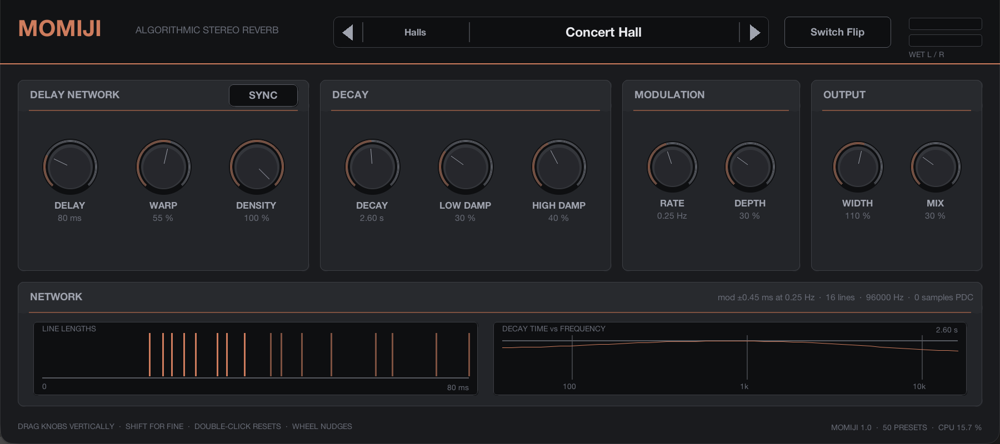

---

## Part 1 — Using Momiji

### 1.1 Installing and loading

Copy `Momiji.jsfx` into REAPER's `Effects` folder (`~/Library/Application Support/REAPER/Effects`
on macOS) or into a subfolder of it. Open the FX browser on a track and choose **JS: Momiji**.
If the plug-in does not appear, use *Options → Preferences → Plug-ins → ReaScript / JSFX →
re-scan*.

Momiji is an audio effect, so it goes on a track that carries sound: an audio track, or a bus that
other tracks send to. On an audio track, use the **Mix** knob to balance dry and wet. On a send
bus, turn **Mix** to 100 % and set the amount of reverb with the send levels instead.

Momiji needs no other files: presets and graphics are inside the one file. It adds no latency
(0 samples of plug-in delay compensation) and uses no look-ahead, so it is safe on live inputs.
It tells REAPER how long its tail is, so an offline render includes the whole tail.

### 1.2 The window at a glance

The panel is 900 × 400 design units and shows everything at once. On a Retina display it is
drawn at double resolution.

| Row | Panels |
|---|---|
| Header | Name, preset browser, **Switch Flip**, wet output meter |
| 1 | DELAY NETWORK (with SYNC), DECAY, MODULATION, OUTPUT |
| 2 | NETWORK: a live picture of the delay lines and of the decay against frequency |
| Footer | Mouse hints, version, preset count, CPU load |

**Working the controls**

- Drag a knob **up or down** to change it. Hold **Shift** for fine control.
- **Double-click** a knob to return it to its default.
- The **mouse wheel** nudges a knob in small steps.
- Every knob shows its **name and current value** in real units underneath: ms or a note
  division for Delay, seconds for Decay, Hz for the modulation rate, percent for the rest. The
  value turns orange while the pointer is over the knob.
- **SYNC** and **Switch Flip** are buttons. SYNC stays lit while it is on.
- The two bars at the top right are the **wet output meter**, left and right, on a 60 dB scale.

Every knob is also a REAPER parameter, so it can be automated with envelopes, mapped to a
controller with *Param → Learn*, and it is saved with the project. In REAPER's parameter list the
knobs appear as *Mix (%)*, *Delay (ms)*, *Warp (%)*, *Density (%)*, *Decay (s)*, *Low Damp (%)*,
*High Damp (%)*, *Mod Rate (Hz)*, *Mod Depth (%)* and *Width (%)*, plus *Sync* and *Sync
Division* for the tempo lock.

### 1.3 Presets


The browser in the header has four parts:

- **◀ ▶** step to the previous or next preset through the whole library. The list wraps around.
- The **category** button (left part of the browser) opens a menu of the eight categories. Choosing
  one loads the first preset in it.
- The **name** button opens a menu of the presets in the current category.
- An asterisk after the name means the settings no longer match the preset. It appears as soon
  as a knob moves away from the stored value and disappears when a preset is loaded again.

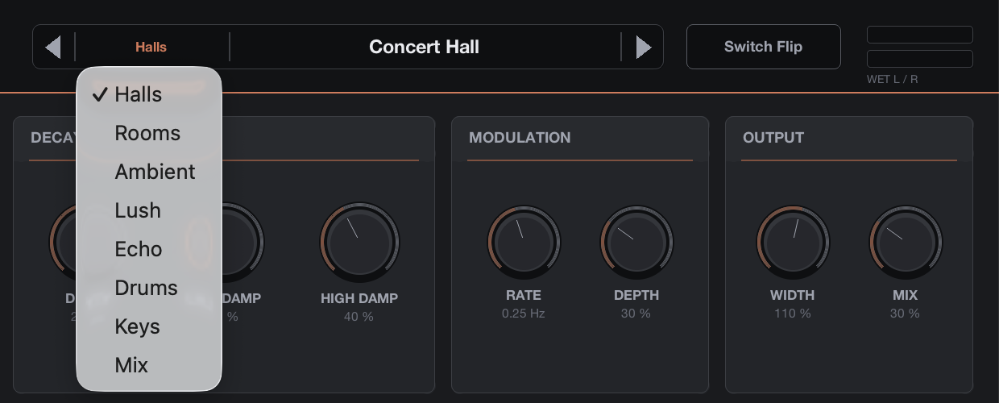 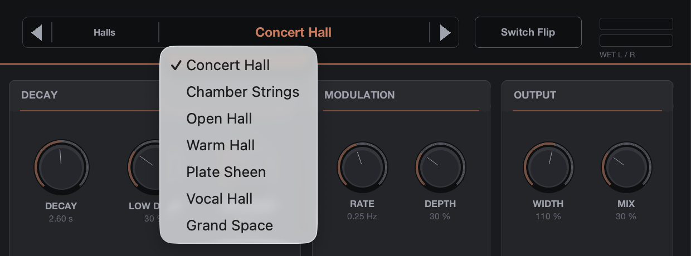

Loading a preset sets all ten knobs. The old reverb tail is faded out over 20 ms, the network is
restarted on the new settings and faded back in, so a preset change never clicks or carries the
old tail into the new sound. Sync and its division are not part of a preset: they stay as you
set them.

A new instance starts on the first preset, **Concert Hall**. To keep a sound of your own, save it
as a REAPER FX preset (the **+** button in the FX window) or simply save the project: Momiji
stores the loaded preset, the edited marker and all knob values with the track.

**The categories**

| Category | What lives there |
|---|---|
| Halls | Concert and chamber spaces with a smooth, dense tail, 2–4 s |
| Rooms | Small and medium spaces, under 1.5 s, for placing sources in a mix |
| Ambient | Long, slow, very dense washes, 7–30 s |
| Lush | Modulated, chorus-like tails for pads, strings and keys |
| Echo | Repeating patterns that blur into reverb; long Delay, low Warp and Density |
| Drums | Rooms and plates tuned on snare, toms, kits and hand percussion |
| Keys | Spaces tuned on electric piano, piano, organ, pads and harp |
| Mix | Short, low-level glue for buses and loops |

**All fifty presets**

| Preset | Delay | Warp | Density | Decay | Low | High | Rate | Depth | Width | Mix |
|---|---|---|---|---|---|---|---|---|---|---|
| **Halls** | | | | | | | | | | |
| Concert Hall | 80 ms | 55 % | 100 % | 2.6 s | 30 % | 40 % | 0.25 Hz | 30 % | 110 % | 30 % |
| Chamber Strings | 75 ms | 65 % | 100 % | 1.9 s | 25 % | 45 % | 0.28 Hz | 32 % | 105 % | 30 % |
| Open Hall | 110 ms | 70 % | 100 % | 3 s | 35 % | 20 % | 0.2 Hz | 28 % | 115 % | 32 % |
| Warm Hall | 95 ms | 55 % | 95 % | 2.7 s | 20 % | 60 % | 0.18 Hz | 30 % | 105 % | 30 % |
| Plate Sheen | 48 ms | 90 % | 100 % | 2.2 s | 55 % | 15 % | 0.35 Hz | 25 % | 120 % | 30 % |
| Vocal Hall | 70 ms | 65 % | 100 % | 2 s | 45 % | 50 % | 0.24 Hz | 28 % | 100 % | 27 % |
| Grand Space | 140 ms | 60 % | 100 % | 3.6 s | 35 % | 35 % | 0.16 Hz | 30 % | 115 % | 34 % |
| **Rooms** | | | | | | | | | | |
| Small Booth | 28 ms | 85 % | 100 % | 0.45 s | 35 % | 55 % | 0.2 Hz | 12 % | 90 % | 22 % |
| Drum Room | 38 ms | 75 % | 100 % | 0.65 s | 30 % | 45 % | 0.25 Hz | 15 % | 105 % | 26 % |
| Wood Room | 45 ms | 70 % | 95 % | 0.85 s | 40 % | 60 % | 0.2 Hz | 18 % | 100 % | 28 % |
| Bright Tile | 34 ms | 80 % | 100 % | 0.75 s | 45 % | 10 % | 0.3 Hz | 10 % | 110 % | 24 % |
| Close Chamber | 55 ms | 65 % | 95 % | 1.1 s | 35 % | 40 % | 0.22 Hz | 20 % | 100 % | 28 % |
| Studio Live | 62 ms | 60 % | 90 % | 1.3 s | 30 % | 35 % | 0.25 Hz | 22 % | 115 % | 30 % |
| **Ambient** | | | | | | | | | | |
| Slow Bloom | 130 ms | 60 % | 100 % | 7 s | 50 % | 45 % | 0.12 Hz | 40 % | 120 % | 36 % |
| Cathedral | 180 ms | 55 % | 100 % | 9 s | 45 % | 40 % | 0.14 Hz | 35 % | 115 % | 35 % |
| Distant Shore | 160 ms | 65 % | 100 % | 12 s | 60 % | 55 % | 0.1 Hz | 45 % | 120 % | 35 % |
| Frozen Air | 120 ms | 75 % | 100 % | 18 s | 65 % | 30 % | 0.08 Hz | 40 % | 125 % | 33 % |
| Endless | 200 ms | 60 % | 100 % | 30 s | 70 % | 45 % | 0.08 Hz | 45 % | 120 % | 32 % |
| Deep Well | 220 ms | 50 % | 95 % | 8 s | 30 % | 75 % | 0.12 Hz | 30 % | 110 % | 40 % |
| Glass Horizon | 100 ms | 80 % | 100 % | 10 s | 60 % | 10 % | 0.1 Hz | 35 % | 125 % | 34 % |
| **Lush** | | | | | | | | | | |
| Velvet Ensemble | 85 ms | 60 % | 100 % | 3.5 s | 35 % | 40 % | 0.45 Hz | 80 % | 120 % | 31 % |
| Chorus Cloud | 110 ms | 55 % | 100 % | 5 s | 40 % | 35 % | 0.6 Hz | 100 % | 125 % | 38 % |
| Silk Strings | 70 ms | 70 % | 100 % | 2.6 s | 30 % | 45 % | 0.35 Hz | 65 % | 115 % | 32 % |
| Slow Swell | 150 ms | 60 % | 100 % | 8 s | 50 % | 40 % | 0.2 Hz | 90 % | 120 % | 35 % |
| Shimmer Wash | 95 ms | 75 % | 100 % | 6 s | 55 % | 15 % | 0.8 Hz | 75 % | 125 % | 34 % |
| Wide Keys | 60 ms | 65 % | 100 % | 1.8 s | 30 % | 40 % | 0.5 Hz | 70 % | 120 % | 30 % |
| Dream Guitar | 120 ms | 55 % | 95 % | 4.5 s | 40 % | 50 % | 0.3 Hz | 85 % | 120 % | 36 % |
| **Echo** | | | | | | | | | | |
| Slap Cluster | 160 ms | 10 % | 15 % | 1.4 s | 30 % | 45 % | 0.2 Hz | 15 % | 110 % | 30 % |
| Eighth Echo | 330 ms | 8 % | 10 % | 2.5 s | 35 % | 50 % | 0.2 Hz | 20 % | 105 % | 32 % |
| Dotted Trails | 480 ms | 12 % | 20 % | 3.5 s | 40 % | 55 % | 0.18 Hz | 25 % | 110 % | 34 % |
| Dub Chamber | 400 ms | 20 % | 35 % | 4 s | 25 % | 70 % | 0.22 Hz | 30 % | 110 % | 36 % |
| Tape Ghost | 260 ms | 15 % | 25 % | 3 s | 45 % | 80 % | 0.3 Hz | 45 % | 100 % | 34 % |
| Echo Into Hall | 300 ms | 30 % | 55 % | 4.5 s | 35 % | 45 % | 0.2 Hz | 30 % | 115 % | 36 % |
| Rhythm Space | 240 ms | 25 % | 45 % | 2.2 s | 30 % | 40 % | 0.24 Hz | 20 % | 110 % | 30 % |
| **Drums** | | | | | | | | | | |
| Snare Room | 40 ms | 80 % | 100 % | 0.7 s | 45 % | 40 % | 0.25 Hz | 12 % | 105 % | 26 % |
| Snare Plate | 55 ms | 90 % | 100 % | 1.6 s | 55 % | 25 % | 0.35 Hz | 22 % | 120 % | 30 % |
| Kit Ambience | 70 ms | 70 % | 100 % | 1.1 s | 40 % | 50 % | 0.22 Hz | 18 % | 115 % | 28 % |
| Gated Feel | 50 ms | 85 % | 100 % | 0.55 s | 60 % | 30 % | 0.3 Hz | 10 % | 110 % | 30 % |
| Big Toms | 95 ms | 60 % | 95 % | 2 s | 20 % | 55 % | 0.18 Hz | 25 % | 115 % | 32 % |
| Hand Percussion | 45 ms | 75 % | 100 % | 1 s | 50 % | 35 % | 0.28 Hz | 16 % | 110 % | 26 % |
| **Keys** | | | | | | | | | | |
| Rhodes Space | 80 ms | 65 % | 100 % | 2.2 s | 35 % | 45 % | 0.3 Hz | 35 % | 115 % | 32 % |
| Piano Hall | 105 ms | 60 % | 100 % | 2.8 s | 30 % | 35 % | 0.2 Hz | 25 % | 110 % | 30 % |
| Organ Chapel | 130 ms | 45 % | 95 % | 4.2 s | 25 % | 50 % | 0.12 Hz | 22 % | 105 % | 32 % |
| Pad Halo | 115 ms | 70 % | 100 % | 5.5 s | 55 % | 30 % | 0.25 Hz | 55 % | 125 % | 36 % |
| Synth Chamber | 65 ms | 70 % | 100 % | 1.6 s | 40 % | 35 % | 0.3 Hz | 30 % | 110 % | 30 % |
| Harp Garden | 90 ms | 75 % | 100 % | 3.2 s | 50 % | 20 % | 0.22 Hz | 35 % | 120 % | 34 % |
| **Mix** | | | | | | | | | | |
| Loop Glue | 60 ms | 65 % | 100 % | 1.2 s | 45 % | 45 % | 0.25 Hz | 20 % | 105 % | 20 % |
| Mix Depth | 85 ms | 60 % | 100 % | 1.8 s | 50 % | 50 % | 0.22 Hz | 25 % | 110 % | 22 % |
| Bus Air | 70 ms | 75 % | 100 % | 1.5 s | 55 % | 15 % | 0.3 Hz | 20 % | 115 % | 16 % |
| Breakbeat Room | 48 ms | 70 % | 100 % | 0.9 s | 40 % | 55 % | 0.25 Hz | 15 % | 105 % | 24 % |

Every preset was tuned by ear on the author's own recordings: drum hits and phrases, electric
piano and keyboard loops, pads and chords, strings, breakbeats, a vocoded loop and guitar
textures. Each preset's Mix was set so that the reverb sits at a sensible level for its purpose,
and none of them clips on ordinary material.

### 1.4 Switch Flip


**Switch Flip** gives you a new sound in one click. It picks one of eight families (a tight room, a
medium hall, a long ambient space, a lush modulated tail, a dark space, a bright open one, an
echo cluster or a wide bloom), sets the nine sound knobs to sensible values inside that family, and
restarts the network on them with the same 20 ms fades as a preset change. **Mix** is left where
you had it, so a flip never changes how loud the reverb is in your mix.

The values are always inside the knob ranges and always musically related to each other: a long
tail gets more low-frequency damping, a fast modulation rate gets less depth, and a very long
Delay keeps the decay finite. The preset name gains an asterisk, because the settings no longer
match a stored preset. If you like the result, save it as a REAPER FX preset. Every press gives
a different result, and the sequence of results is stored with the project.

### 1.5 The delay network

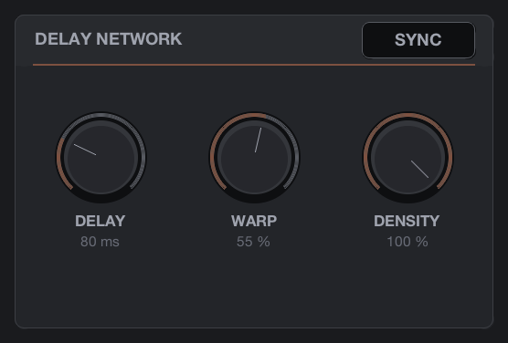

Momiji is built on sixteen delay lines whose outputs are mixed together and fed back into each
other. These three knobs set the shape of that network.

| Control | Range | What it does |
|---|---|---|
| DELAY | 20 ms – 4 s | The length of the longest line. Small values give small rooms; large values give big spaces or, with low Warp and Density, audible echoes. At 384 kHz the maximum is about 3.4 s |
| WARP | 0 – 100 % | How the other fifteen lines are spread below the longest one. Low values cluster them near the longest line, so the reverb repeats like an echo. High values spread them out over a wide range of lengths, which is what makes a smooth, dense reverb |
| DENSITY | 0 – 100 % | How strongly the lines are mixed with each other on every pass. At 100 % the tail becomes dense within a few passes. At low values each line mostly feeds itself, so the repeats stay separate |

Changing **DELAY** does not jump. The lines glide to their new length, the same way a tape
machine changes pitch when its speed changes, and the glide is limited to a pitch bend of one semitone at most, reached gradually, so an
automated Delay sweep produces a smooth bend instead of a click. Large changes take a few seconds to complete; the NETWORK
display shows the lines moving.

**WARP** and **DENSITY** change smoothly too, and they never make the reverb louder or unstable:
the mixing of the lines preserves energy at every setting.

### 1.6 Tempo sync

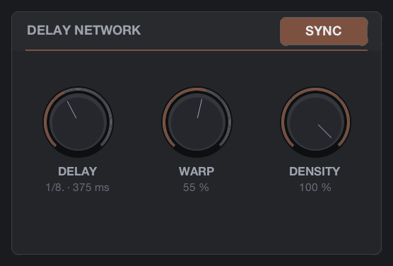

Click **SYNC** to lock the longest line to the project tempo. The DELAY knob then steps through
21 note divisions instead of milliseconds, and its readout shows the division together with the
time it gives at the current tempo:

| Division | Straight | Triplet (T) | Dotted (.) |
|---|---|---|---|
| 1/32 | one thirty-second note | two thirds of it | one and a half times it |
| 1/16 | one sixteenth | | |
| 1/8 | one eighth | | |
| 1/4 | one beat | | |
| 1/2 | two beats | | |
| 1 | one bar (four beats) | | |
| 2 | two bars | | |

At 120 BPM, 1/4 is 500 ms, 1/8 is 250 ms, 1/8. is 375 ms and 1/8T is 167 ms; a whole note is
2 s and two whole notes 4 s. The default division is 1/8.

When the tempo changes, gradually or at a tempo marker, the lines glide to the new length. When
you choose a different division, the tail is faded out and the network restarted on the new
length, exactly as for a preset change. The NETWORK panel's readout shows the tempo Momiji is
following:

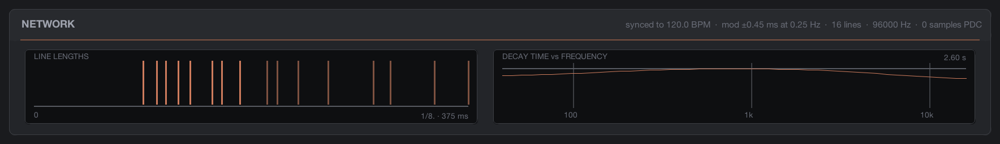

Switching SYNC off returns the knob to milliseconds, at the value it had before. In the parameter
list the tempo lock is *Sync* (Off / On) and *Sync Division*; the *Delay (ms)* parameter is only
used while Sync is off.

### 1.7 Decay and damping

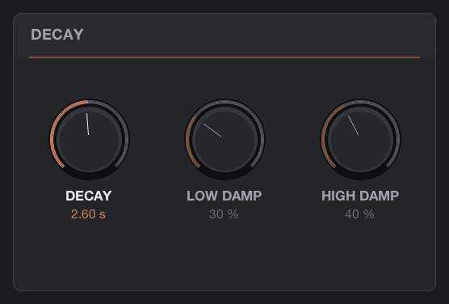

| Control | Range | What it does |
|---|---|---|
| DECAY | 0.2 – 40 s | How long the tail takes to fall by 60 dB in the middle of the spectrum. The decay is set inside the feedback loop, so it is the same whatever the Delay: a 3 s decay is 3 s in a small room and in a huge hall |
| LOW DAMP | 0 – 100 % | Shortens the decay of the low frequencies. At 100 % the bass decays in about a third of the mid-band time, and the effect reaches up to about 360 Hz; at low settings it only touches the region below 100 Hz |
| HIGH DAMP | 0 – 100 % | Shortens the decay of the high frequencies. At 100 % the treble decays in about a sixth of the mid-band time, and the effect reaches down to about 2.5 kHz; at low settings only the top octave above 9 kHz is touched |

Both damping controls work inside the loop, so every pass through the network darkens the
sound a little more, which is how real rooms behave: the tail becomes darker as it fades, rather
than being filtered once at the output. Low damping keeps long tails from piling up bass under a
mix; high damping is the main tone control for a natural sound.

With a very long Delay the decay cannot be shorter than two passes through the longest line, so
at 4 s of Delay the shortest decay is 8 s. The DECAY TIME vs FREQUENCY graph in the NETWORK
panel always shows the decay that is actually in force.

### 1.8 Modulation

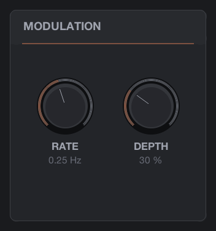

| Control | Range | What it does |
|---|---|---|
| RATE | 0.05 – 2 Hz | How fast the line lengths wobble |
| DEPTH | 0 – 100 % | How far they wobble |

Modulation is what turns a static, metallic tail into a living one. Momiji moves all sixteen line
lengths from one slow oscillator, each line at its own phase and half of them in the opposite
direction, so the total length of the loop never changes and the pitch of the tail stays centred.
The movement is limited to at most 1.5 ms and, at any rate, to a pitch wobble of about a tenth of
a semitone in a single pass: at higher rates the depth is reduced automatically so the pitch
never smears. The NETWORK panel's readout shows the actual excursion in ms and the actual rate.

**DEPTH at 0 % is a valid setting.** The network is designed so that the tail is dense and free of
ringing without any modulation; the Rooms and Drums presets use very little, and a chorus-like
shimmer (the Lush presets) needs a lot. Somewhere between 20 % and 40 % at 0.2–0.3 Hz is a good
starting point for a natural hall.

### 1.9 Output

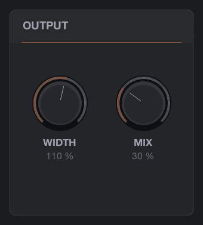

| Control | Range | What it does |
|---|---|---|
| WIDTH | 0 – 200 % | The stereo width of the wet signal. 0 % is mono, 100 % is the network's own image (left and right tails are already almost uncorrelated), 200 % exaggerates the difference between the sides |
| MIX | 0 – 100 % | The balance of dry and wet. The crossfade is equal-power, so the loudness stays even across the knob |

The dry signal passes straight through without any delay. The meter in the header shows the wet
signal after WIDTH, before it is mixed with the dry signal, so it reads the reverb's own level.

### 1.10 The NETWORK display

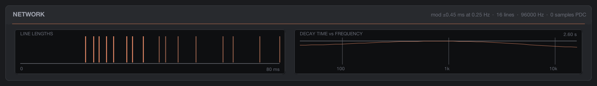

The lower panel is a picture of the current state of the reverb.

- **LINE LENGTHS** shows the sixteen lines on a time axis from 0 to the longest line, whose
  length is written at the right. With high Warp the lines spread across the axis; with low Warp
  they bunch up at the right. While Delay is gliding, the lines move. Density does not change
  any length, only how strongly the lines feed each other, so it does not move the bars; instead
  it sets their brightness: bright at 100 %, where the lines are fully mixed, faint at 0 %, where
  they are kept apart.
- **DECAY TIME vs FREQUENCY** shows the decay Momiji will produce at each frequency from 40 Hz
  to 16 kHz, calculated from the current Decay, Low Damp and High Damp settings. The grey line
  is the mid-band decay set by the knob (written at the top right), the vertical lines mark
  100 Hz, 1 kHz and 10 kHz.
- The **readout** under the panel title gives the current modulation excursion and rate, the
  number of lines, the sample rate, the tempo when synced, and the plug-in delay (always 0).

An Echo preset (long Delay, low Warp, Density 10 %, so the bars are faint) and a dark one look
like this:

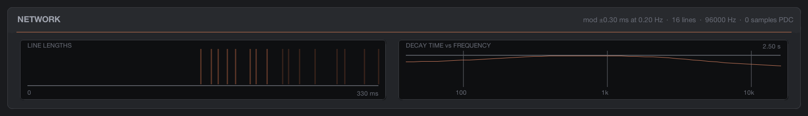

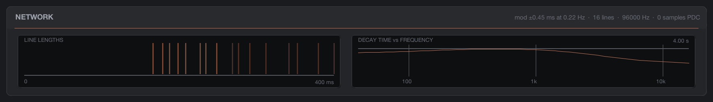

### 1.11 What happens when you move a knob

Every knob is smoothed, so moving it by hand or with automation never clicks:

- **Decay, Low Damp, High Damp, Warp, Density, Mod Rate, Mod Depth, Width and Mix** slide to
  their new value over a fraction of a second.
- **Delay** glides, as described in 1.5.
- **Loading a preset, Switch Flip, turning Sync on or off, or choosing a new division**
  fades the tail out over 20 ms, restarts the network, and fades it in again. The old tail is
  not carried over.
- **Changing the sample rate** restarts the network in the same way.

Momiji also watches its own output. If anything inside the loop ever went wrong (a non-finite
value, or a level far beyond what the settings allow), the network is reset and faded back in
within 5 ms. This has not happened in any test, and there is no way to make it happen from the
controls; the guard is there so that the worst case is a short dropout rather than a stuck tail.

### 1.12 Recipes

- **A vocal in a hall**: start from *Vocal Hall*. Raise High Damp to 60–70 % if the reverb
  sounds sibilant, and lower Mix until the voice sits in front of the reverb rather than inside
  it.
- **Drums that stay tight**: *Drum Room* or *Snare Room* on a send; keep Depth low (under 15 %)
  so transients do not blur, and use Low Damp around 40–50 % to keep the kick clean.
- **An eighth-note echo that turns into a room**: turn Sync on, choose 1/8 or 1/8., set Warp to
  10 %, Density to 15 %, Decay to 2–3 s and High Damp to 60 %. Raising Density towards 50 %
  turns the repeats into a wash; *Echo Into Hall* is this recipe with the values chosen.
- **An endless pad bed**: *Frozen Air* or *Endless* with Mix at 100 % on its own send, then
  automate the send level. Low Damp at 60–70 % keeps the bed from filling the low end.
- **A chorused string tail**: *Silk Strings* or *Velvet Ensemble*; Depth 60–90 % at 0.3–0.5 Hz
  is the chorus, and Width at 115–125 % spreads it.
- **Something new**: press **Switch Flip** a few times while a loop plays; when one fits, adjust
  Decay and Mix and save it as an FX preset.

---

## Part 2 — How Momiji is built

This part is for the curious and for anyone who wants to modify the file. Everything here was
measured while building the reverb.

### 2.1 One file, two threads of work

`Momiji.jsfx` is a REAPER JSFX effect written in EEL2. The audio sections (`@init`, `@slider`,
`@block`, `@sample`, `@serialize`) run on REAPER's audio thread; the interface (`@gfx`) runs on the
UI thread at 30 frames per second and talks to the engine only through the slider values, a
one-word preset or flip request, and the peak meter. The twelve parameters are ordinary sliders,
hidden from REAPER's generic view, which is what makes automation, controller mapping and
project state free.

### 2.2 The network

The reverb is a feedback delay network: sixteen delay lines, read once per sample, mixed by a
fixed pattern of additions and subtractions, filtered, and written back. The input is spread
over all sixteen lines with alternating signs so that a mono source and a stereo source both
reach every line, and the two outputs are taken with two different sign patterns so that left and
right are almost uncorrelated. The mixing between passes is a chain of four "butterfly" stages of
paired rotations, all sharing one angle, followed by a fixed reordering with signs. Whatever the
angle, this mix neither adds nor removes energy, so the decay is governed entirely by the
per-line gains and the network can never run away. **Density** is that angle: a small angle
leaves each line almost on its own, a large one mixes them thoroughly on every pass.

The sixteen line lengths are the longest line multiplied by sixteen fixed ratios, each raised to a
power set by **Warp** (from 0.35 at 0 %, which pulls the lines together, to 1.2 at 100 %). The
ratios were chosen by a search for the set whose lengths share the fewest common multiples, so
no combination of settings lines up into a comb of repeated echoes; with round three-decimal
ratios the tail took six times longer to become dense.

### 2.3 Reading between samples

The lines are read at fractional positions, because modulation and the Delay glide move the read
points continuously. Momiji uses a seventh-order interpolation (eight neighbouring samples
weighted by a polynomial), which is accurate across the whole audio band; when a line is not moving, the
read point is snapped to an integer and the interpolation is skipped entirely, so a static reverb
reads each line with one plain memory access.

### 2.4 Decay and damping

Each line has its own gain, computed from its length so that every line loses the same amount
per second and the whole tail falls 60 dB in the time set by **Decay**. The gain is capped a
little below unity, so a 40 s decay on a 20 ms line is still a decaying tail rather than an
infinite one. In series with the gain sit two shelving filters per line, one for the lows and one
for the highs, built so that their gain is never above one at any frequency: **Low Damp** and
**High Damp** set how far below one, and move the corner frequency at the same time. The decay
curve drawn in the NETWORK panel is calculated from these filters and gains, and the measured
decay per octave band matches it within a few percent.

### 2.5 Modulation

One sine and cosine oscillator runs at the **Mod Rate**. Each line takes the oscillator at one of
eight phases, and the sixteen lines are arranged in opposite pairs, so the sum of all sixteen
delays is constant at every instant: the tail's pitch stays centred while the individual lines
move. The excursion is limited by a budget on the pitch slope each line can produce in one pass
(about a tenth of a semitone) and by a hard maximum of 1.5 ms, so the audible result at full depth
is a chorus-like shimmer without pitch drift. The oscillator's amplitude is renormalised every
4096 samples so it can run for days.

### 2.6 Changing settings without clicks

The controls are read every 32 samples and their targets are smoothed; the per-line gains and
filter coefficients then ramp linearly between control points, so nothing steps. Delay changes
glide with a limit on the pitch slope and on how fast that slope may change, which is what
removes the click that a plain slew produces at every automation step. Preset changes and flips
raise a 20 ms fade-out, then restart the network and fade in. When the geometry changes, old
line contents are not cleared but marked invalid and treated as silence until overwritten, which
costs nothing per sample.

### 2.7 Memory and sample rates

At start-up Momiji lays out its memory from the largest possible settings at the current sample
rate, not from the current knob values, so no later knob movement can need memory it does not
have: about 3.3 MB at 48 kHz, 6.6 MB at 96 kHz and 26 MB at 384 kHz. At 384 kHz a 4 s longest line would
exceed the 16 million memory slots the file reserves, so there the Delay maximum is reduced to
about 3.4 s. All timing is computed from the sample rate, so a 3 s decay measures 3.0 s at
44.1, 96 and 192 kHz and the first reflection arrives at the same time at every rate.

### 2.8 Cost

Measured live in REAPER on an Apple M1 Max at 96 kHz with 128-sample blocks: about 20 % of the
block time with modulation depth at 0 (the integer read path), about 34 % with full modulation
(the interpolated path). At 48 kHz, half of that. The figure is shown live in the footer. The
per-line code is written out sixteen times rather than as a loop over an array, because in EEL2
every array access is a function call: the loop form measured 28 % of the block where the
written-out form measures 20 %.

### 2.9 How it was verified

Nothing in this manual is asserted from reading the code. An automated harness drives REAPER from
the command line, renders through the plug-in and measures the audio, and a separate C program
implements the same reverb sample for sample as an independent reference:

- REAPER's renders equal the reference program to within 0.00000002 at every tested setting,
  including the extreme 40 s decay on a 20 ms line. Every check was first shown to go red on a
  planted defect (a one-sample delay error, a reversed rotation sign, a 1 % interpolation
  error, an inverted filter, a gain above one).
- Stress signals (full-scale DC, alternating ±1, 20 Hz, near-Nyquist tones, noise bursts, sweeps)
  at 40 s decay, no damping, full modulation, 2 Hz and 200 % width: every output finite and
  bounded, at 44.1, 48, 96, 192 and 384 kHz.
- The tail is dense: measured echo density reaches the diffuse level within a fraction of a
  second at every Delay and every Density above 75 %, and the late tail's spectrum has no
  dominant ringing at any Warp or Delay.
- The decay per octave band matches the drawn curve; low and high damping do what the tables
  in 1.7 say.
- With full modulation the tail's pitch stays within a few cents of the input at every rate.
- Every parameter was automated with steps and sweeps in the host, alone and all together:
  finite, bounded, no click above −64 dB, with one documented exception (reversing an 11 s
  Delay glide in mid-flight, at −43 dB: the audible pitch bend of the glide itself).
- The dry path adds no delay; bypass and dry render land on the same sample.
- The panel was tested with real mouse gestures: every knob drags both ways, Shift is fine,
  double-click resets, the arrows and menus load presets, Sync switches the knob, and Switch
  Flip gives three distinct in-range states with Mix untouched.
- All fifty presets render finite and decaying, at a level within about 2 dB of the dry material
  at their own Mix, and were auditioned on the author's own recordings.
- Twenty minutes at 48 kHz and twelve minutes at 192 kHz at the maximum decay, no damping and
  full modulation: the tail only ever falls, no fault, no non-finite value.
- Preset changes and flips during a sustained tone: every change fades the old tail out by at
  least 40 dB and the largest step in the output is the tone's own slope, so nothing clicks.

---

## Part 3 — Licence and provenance

### 3.1 Licence

Momiji is released under the **MIT License**. The full text is also embedded at the top of
`Momiji.jsfx`:

```
MIT License

Copyright (c) 2026 Michele Ibba

Permission is hereby granted, free of charge, to any person obtaining a copy
of this software and associated documentation files (the "Software"), to deal
in the Software without restriction, including without limitation the rights
to use, copy, modify, merge, publish, distribute, sublicense, and/or sell
copies of the Software, and to permit persons to whom the Software is
furnished to do so, subject to the following conditions:

The above copyright notice and this permission notice shall be included in
all copies or substantial portions of the Software.

THE SOFTWARE IS PROVIDED "AS IS", WITHOUT WARRANTY OF ANY KIND, EXPRESS OR
IMPLIED, INCLUDING BUT NOT LIMITED TO THE WARRANTIES OF MERCHANTABILITY,
FITNESS FOR A PARTICULAR PURPOSE AND NONINFRINGEMENT. IN NO EVENT SHALL THE
AUTHORS OR COPYRIGHT HOLDERS BE LIABLE FOR ANY CLAIM, DAMAGES OR OTHER
LIABILITY, WHETHER IN AN ACTION OF CONTRACT, TORT OR OTHERWISE, ARISING FROM,
OUT OF OR IN CONNECTION WITH THE SOFTWARE OR THE USE OR OTHER DEALINGS IN
THE SOFTWARE.
```

The licence covers `Momiji.jsfx` as a whole: the engine, the interface, the preset library and
this manual.

### 3.2 What is in the file and where it came from

Every line of `Momiji.jsfx` was written for Momiji; no code from any other project is
incorporated. The design follows a written specification prepared for this reverb, and uses
published techniques from their descriptions: feedback delay networks with per-line attenuation
(Jot and Chaigne, 1991; Schlecht and Habets, 2017), scattering by orthogonal rotations, Lagrange
fractional-delay interpolation (J. O. Smith, *Physical Audio Signal Processing*), and the
normalised echo-density measure used in its verification (Abel and Huang, 2006). The delay
ratios, the presets, the graphics and the text are original. Nothing from any commercial reverb is
reproduced.

### 3.3 Names

"Momiji" is the plug-in's own name and is not connected to any product of the same name.
