# Raja — User Manual

Raja is a beat replayer for REAPER. It is one file, `Raja.jsfx`. It catches a moment of the sound
passing through it, at a place you schedule or at the press of a button, and repeats a slice of that
moment: a stutter, a fill, a held texture, a falling pitched echo. Randomness is optional and, when
you want it, repeatable. This manual has three parts: how to use it, how it is built, and the licence
it comes with.

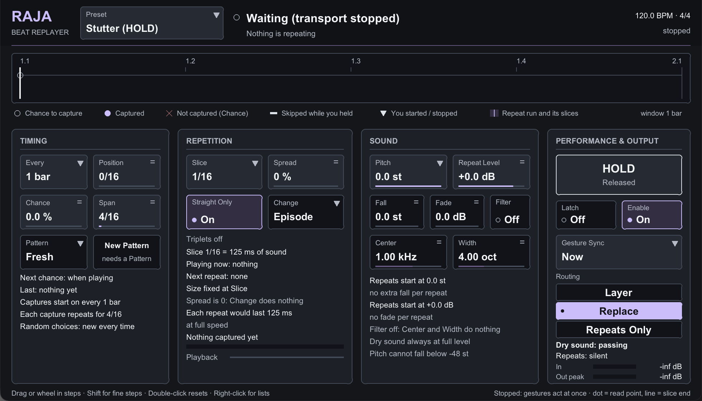

---

## Part 1 — Using Raja

### 1.1 Installing and loading

Copy `Raja.jsfx` into REAPER's `Effects` folder (`~/Library/Application Support/REAPER/Effects` on
macOS, `%APPDATA%\REAPER\Effects` on Windows) or into a subfolder of it. Open the FX browser on a
track and choose **JS: Raja**. If the plug-in does not appear, reopen the FX browser (JSFX files
are scanned when it opens) or use its right-click *Scan for new plugins*.

Raja is an audio effect, so it goes on a track that carries sound: drums, a loop, a vocal, a bus. It
adds no latency and uses no look-ahead, so it is safe on live inputs. With its factory settings it
passes the sound through unchanged; nothing happens until you raise **Chance** or press **Hold**.
That state is also its first preset, *Stutter (HOLD)*; the other nineteen are listed in section 1.13.

Raja keeps working with its window closed. Everything you set is a REAPER parameter, saved with the
project; the captured sound itself is never saved, so a reopened project starts silent and waits for
a new capture.

### 1.2 The window at a glance

The panel is 980 × 560 design units and shows everything at once; it scales with the window. On a
Retina display it is drawn at double resolution.

| Row | What is there |
|---|---|
| Header | Name, the preset selector, what is happening now in one line, who owns the sound, tempo and meter |
| Timeline | One bar (or one Every cycle, or one Pattern) with capture chances, captures, repeats and the play position |
| TIMING | Every, Position, Chance, Span, Pattern, New Pattern, and facts about the next and last capture |
| REPETITION | Slice, Spread, Straight Only, Change, and facts about the repeat that is playing |
| SOUND | Pitch, Repeat Level, Fall, Fade, Filter, Center, Width, and the pitch and level now |
| PERFORMANCE & OUTPUT | HOLD, Latch, Enable, Gesture Sync, Routing, the dry and repeat paths, meters |
| Footer | Mouse hints on the left, or the hint for the control under the pointer; on the right, the key to the playback bar and, when the transport is stopped, a reminder that presses act at once |

**Working the controls**

- **Drag** a field up or down (or sideways) to change it. Plain drags move in musical steps so
  round values land exactly: 1 % on Chance, 5 % on Spread, one semitone on Pitch and Fall, 1 dB on
  Repeat Level and Fade, a quarter octave on Width, and the standard third-octave frequencies
  (500, 630, 800, 1 k, 1.25 k …) on Center. Hold **Shift** for fine steps.
- The **mouse wheel** moves one step per notch; with Shift, one fine step.
- **Double-click** a field to return it to its default.
- A field with a small **triangle** (Every, Slice, Change, Gesture Sync, Pattern, Pitch) also opens a
  list on a **right-click**; Pitch's list is whole semitones. A field with two short **grip lines**
  is drag-only.
- **HOLD** repeats for as long as the mouse button is down; letting go anywhere stops it.
- The **Preset** box in the header opens Raja's own list on a click; a click on a row loads that
  preset, a click anywhere else (or a right-click) closes the list, and the wheel over the box steps
  through the presets. Its label reads *Preset · edited* as soon as any value differs from the preset.
- **Latch**, **Enable**, **Straight Only** and **Filter** switch on a click. **Routing** is three
  buttons; the lit one is active.
- Every field shows its **name and current value** in real units. Bright fields are the main
  controls; dark ones are the shaping controls you touch less often.

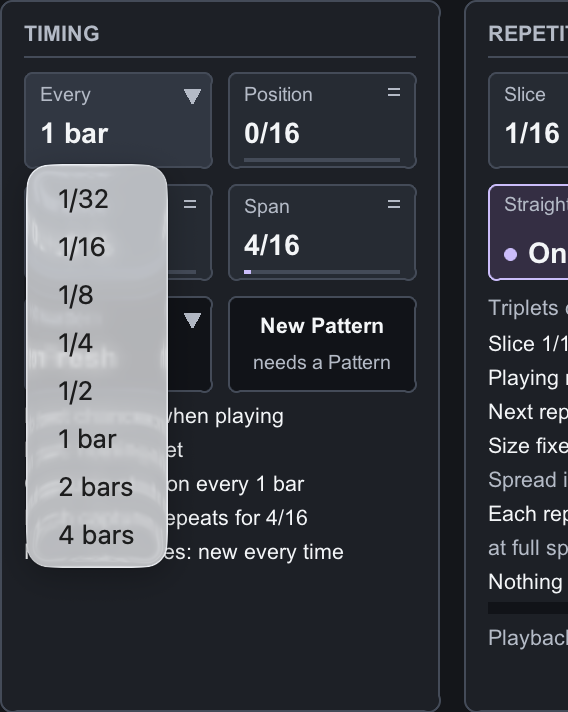 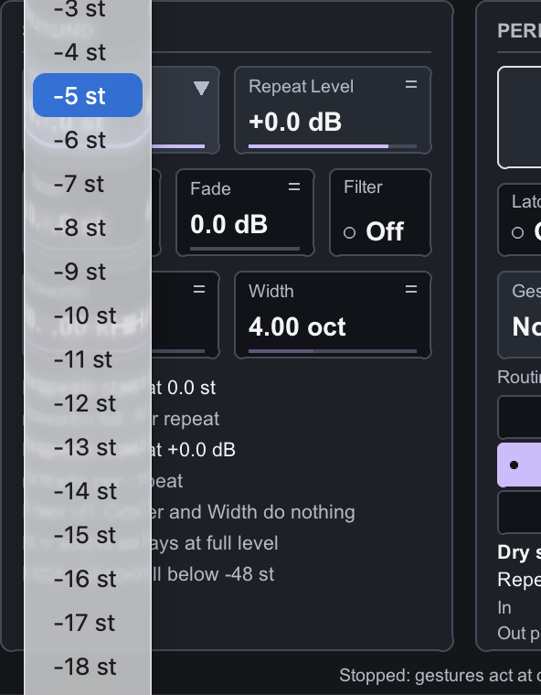


Every control is a REAPER parameter, so it can be automated with envelopes, mapped to a controller
with *Param → Learn*, and driven from a control surface. In REAPER's parameter list they appear as
*Every*, *Position (1/16)*, *Chance (%)*, *Span (1/16)*, *Slice*, *Straight Only*, *Spread (%)*,
*Change*, *Pitch (semitones)*, *Fall (semitones per traversal)*, *Repeat Level (dB)*, *Fade (dB per
traversal)*, *Filter*, *Center (Hz)*, *Width (octaves)*, *Routing*, *Enable*, *Hold*, *Latch*,
*Gesture Sync*, *Pattern* and *New Pattern*. ("Traversal" is the technical word for one repeat.)

### 1.3 How a repeat happens

Three questions decide everything Raja does: **when** may it catch something, **how much** of it
should repeat, and **when** should the original sound come back.

1. **A chance to capture** comes round on a schedule: **Every** sets how often (from a thirty-second
   note to four bars), **Position** shifts every chance later, in sixteenths.
2. At each chance Raja rolls a die: **Chance** is the probability that it captures. 0 % never
   captures, 100 % always does.
3. A capture starts recording the sound from that instant and immediately plays it back in repeats.
   **Slice** is how much of the recording each repeat plays, as a note length; the first repeat is
   the live sound itself, later repeats replay the same slice from its start.
4. An automatic capture lasts **Span**, measured from the capture. Then the original sound returns.
   A capture that comes before the previous one has finished replaces it: repeats never pile up.
5. **HOLD** and **Latch** bypass the schedule: they capture the moment you press and keep repeating
   until you let go. While you hold, automatic chances are skipped and the panel says so.

Everything else shapes the repeats: **Spread** and **Change** vary the slice size, **Pitch** and
**Fall** lower it, **Repeat Level** and **Fade** set and reduce its level, the **Filter** narrows
its band, and **Routing** decides whether the repeats sit on top of the dry sound, replace it, or are
heard alone.

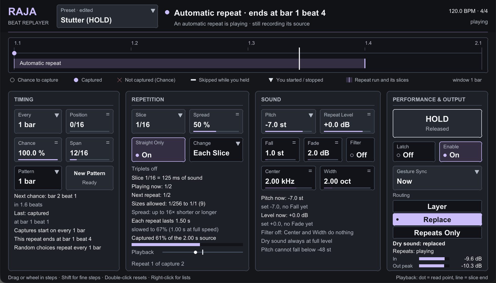

Above, an automatic repeat at 120 BPM: the capture on beat one, its fourth repeat playing at
1/1 after a 1/16 start (Spread and Change at work), the pitch three semitones lower than set
because Fall has accumulated, the level six decibels down through Fade, and the dry sound replaced.

### 1.4 The header, the presets and the timeline

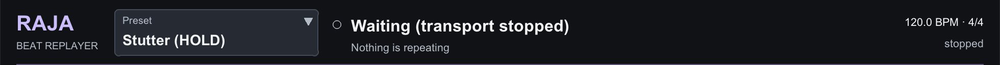
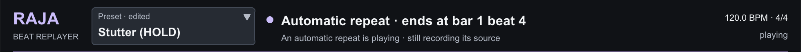
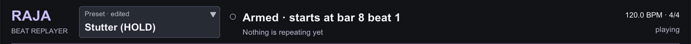
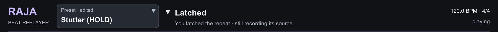
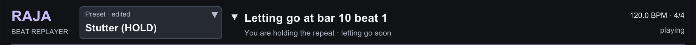
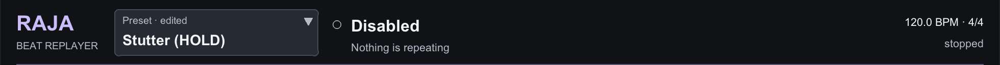

The headline is what is happening now or about to happen: *Waiting for a capture*, *Automatic
repeat · ends at bar 2 beat 4*, *Held*, *Latched*, *Armed · starts at bar 3 beat 1*, *Letting go at
bar 5 beat 1*, *Fading out*, *Disabled*. The line under it says who owns the sound, so an armed
entry is never mistaken for a repeat already playing. The small glyph before the headline is an
empty circle when nothing repeats, a filled circle for an automatic repeat and a triangle for one
you started. Tempo, meter and *playing* or *stopped* are on the right.

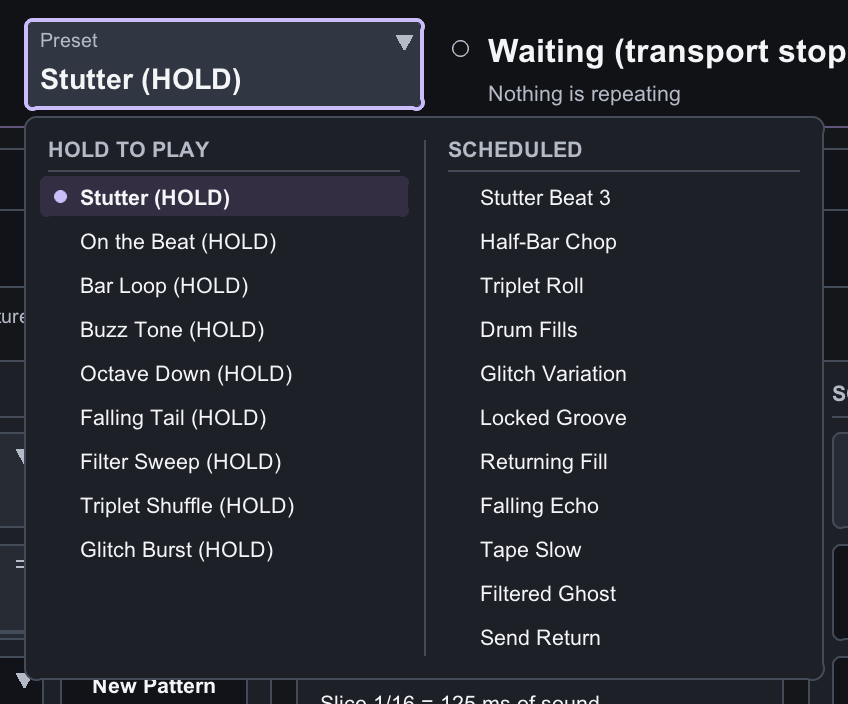

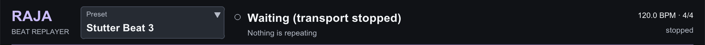
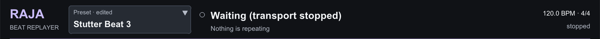

Between the name and the headline sits the **Preset** box. A click opens the list, drawn in the
panel's own colours: nine presets to play by hand on the left, marked *(HOLD)*, and eleven
scheduled presets on the right; the current one carries a dot. A preset sets the eighteen sound and
timing controls (everything on the Timing, Repetition and Sound cards, plus Routing and Gesture
Sync). It never touches Enable, HOLD, Latch or New Pattern, so choosing a preset while you hold
changes the repeat's settings without letting go of it. Every preset can be edited freely: as soon as
one value differs, the label reads *Preset · edited*, and choosing the preset again restores it. The
chosen preset is saved with the project, together with your edits. Section 1.13 describes what each
preset does.

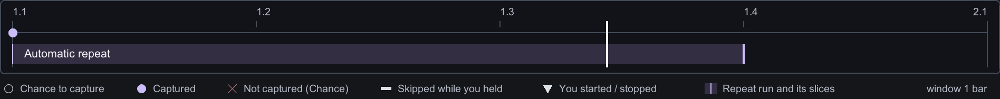

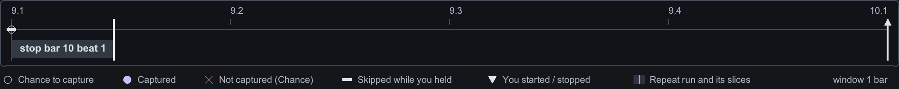

The timeline shows one window: a bar, or the Every cycle, or the Pattern length, whichever is
longest. On the upper line, hollow circles are the chances to capture, a filled circle a capture, a
cross a chance the die refused, a short bar a chance skipped because you were holding, a triangle
pointing down the moment you started a repeat and pointing up the moment you stopped it. Below, a
band marks the repeat: violet from a capture to its automatic end, silver from your press to now
(Raja never predicts when you will let go), with a line at every repeat. The white line is the play
position. When a start or stop is promised to a musical boundary, a silver line marks that boundary
with the word *start* or *stop*. The timeline is a display, not an editor: nothing on it can be
clicked.

### 1.5 Timing

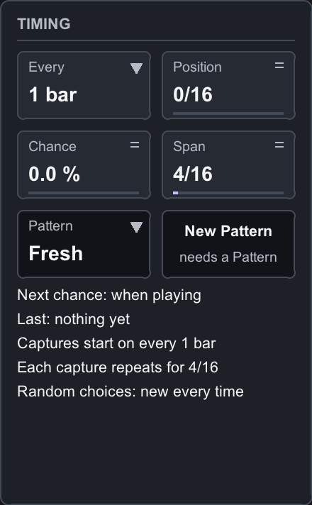 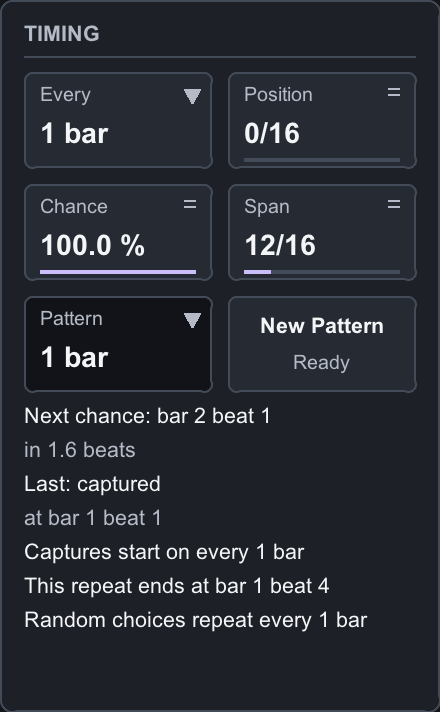

| Control | Values | What it does |
|---|---|---|
| EVERY | 1/32, 1/16, 1/8, 1/4, 1/2, 1 bar, 2 bars, 4 bars | How often a chance to capture comes round. Note values are counted from each bar's downbeat, so a bar that does not divide evenly drops the last partial step |
| POSITION | 0 – 15 sixteenths | Shifts every chance later by that many sixteenths. With Every at 1 bar, 8/16 puts the chance on beat 3. A shift longer than the Every step wraps around it: with Every at 1/4, 5/16 acts as 1/16. The readout shows the effective offset |
| CHANCE | 0 – 100 % | The probability that a chance becomes a capture. 0 % never, 100 % always (unless you are holding). A refused chance leaves a repeat that is already playing alone |
| SPAN | 1 – 64 sixteenths | How long an automatic repeat lasts, from the capture. It is not a number of repeats: a Span of 5/16 with a 1/8 slice gives two and a half repeats, the last one cut short. Editing Span while a repeat plays applies to the next capture |
| PATTERN | Fresh, 1 bar, 2 bars, 4 bars | Fresh rolls new dice every time. The other settings make the random decisions come back at the same places every 1, 2 or 4 bars (section 1.9) |
| New Pattern | button | Draws a different set of random decisions, applied from the next automatic capture. Greyed while Pattern is Fresh |

The readouts under the fields say where the next chance is and how far away it is, what happened at
the last chance and where, how far into each cycle captures start, when the current repeat ends
(or that it ends when you let go), and how the randomness is repeating. While you hold or latch, the
card adds **You are in control; automatic waits**: the automatic controls stay editable and take
effect again as soon as you let go.

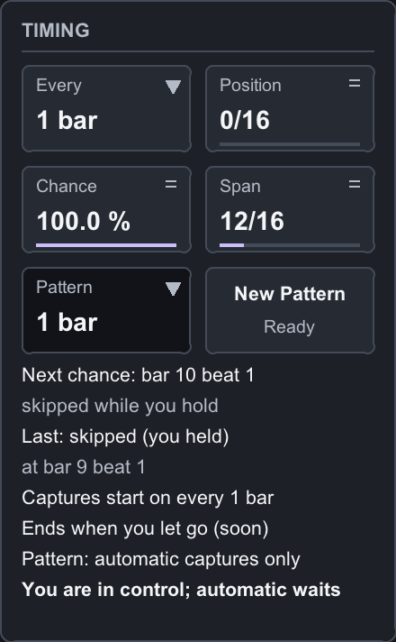

### 1.6 Repetition

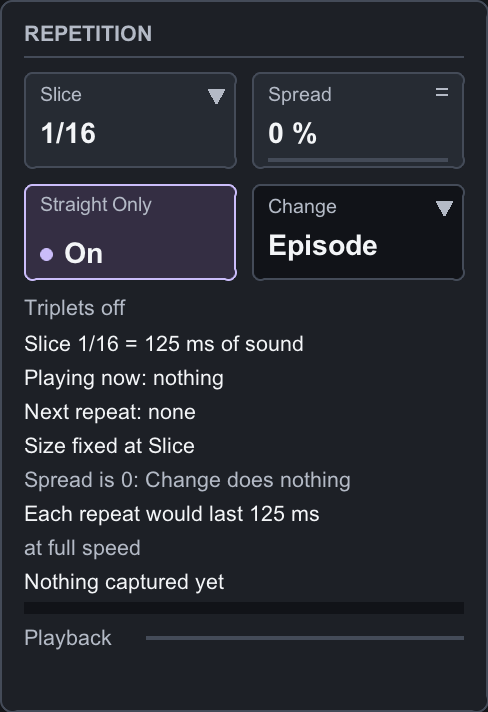 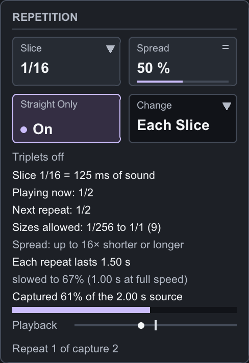

| Control | Values | What it does |
|---|---|---|
| SLICE | 1/256 … 1/1, with triplets | How much of the captured sound each repeat plays, as a note length. Large slices replay recognisable phrases; small ones stutter; below about 1/64 the repeats fuse into a buzz whose pitch depends on the slice length, which is a sound in its own right |
| STRAIGHT ONLY | Off / On | On removes the triplet sizes from both the Slice list and the random choices. A triplet already chosen plays as its straight neighbour from the next repeat |
| SPREAD | 0 – 100 % | Lets the slice size vary from repeat to repeat by admitting note values shorter and longer than Slice. 0 % keeps every repeat at Slice. Each 12.5 % admits one more halving and one more doubling of the note value: with Slice at 1/16, 25 % allows 1/64 to 1/4 and 50 % allows 1/256 to 1/1; 100 % allows every size whatever Slice is. Triplet sizes join in when Straight Only is off. The readout names the sizes allowed and how much shorter or longer than Slice they may be |
| CHANGE | Episode, 1/4, 1/8, 1/16, Each Slice | When a new size is drawn: once per capture, on every quarter, eighth or sixteenth of the bar (the new size waits for the next repeat to start), or for every repeat. With Spread at 0 it does nothing |

The sizes, as fractions of a whole note, are 1/256, 1/128T, 1/128, 1/64T, 1/64, 1/32T, 1/32, 1/16T,
1/16, 1/8T, 1/8, 1/4T, 1/4, 1/2T, 1/2, 1/1T and 1/1. A triplet lasts two thirds of its straight
neighbour: 1/8T is a third of a beat. At 120 BPM a 1/16 is 125 ms and a 1/1 is two seconds.

A capture records up to one whole note of sound. Changing Slice while a repeat plays does not
recapture: a larger slice simply plays more of the same recording, a smaller one less, from the same
starting point, and the change takes effect at the next repeat.

The readouts say the slice length in time, the size playing now and the one chosen next, the allowed
range, how long each repeat actually lasts once Pitch has slowed it (and how long it would last at
full speed), and two bars: how much of the source has been captured so far, and where in it the
playback is (the dot) against the end of the current slice (the line).

### 1.7 Sound

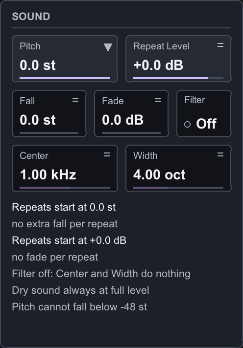 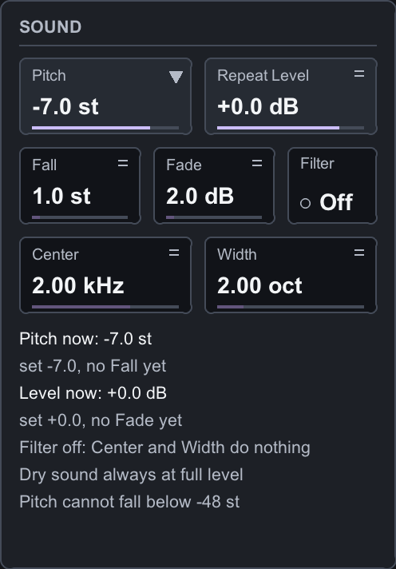

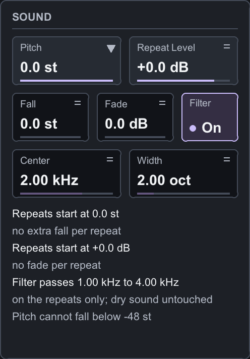

| Control | Range | What it does |
|---|---|---|
| PITCH | −36 … 0 semitones | Lowers the repeats. Lowering the pitch slows the playback, so a repeat lasts longer than its slice: at −12 st a 1/16 slice takes an eighth note. Raja does not hide this; the readout shows both durations |
| REPEAT LEVEL | Silence … +12 dB | The level of the repeats. The dry sound is never changed |
| FALL | 0 – 12 semitones | Each repeat after the first plays this much lower again, down to a floor of −48 st in total, so a run of repeats slides downward |
| FADE | 0 – 24 dB | Each repeat after the first plays this much quieter again, so a run of repeats dies away. A faded repeat still counts as playing: in Replace routing the dry sound stays off until the Span ends |
| FILTER | Off / On | Narrows the repeats to a band. The dry sound is never filtered |
| CENTER | 20 Hz – 20 kHz | The middle of that band, on a logarithmic scale |
| WIDTH | 0.25 – 10 octaves | The width of the band around Center. The readout shows the band's edges |

Fall and Fade accumulate from the first repeat of a capture and reset only with a fresh capture:
lowering them mid-run does not undo what has already fallen or faded. Pitch changes take effect at
the next repeat and keep the accumulated Fall; Repeat Level, Filter, Center and Width act at once.

### 1.8 Performance and output

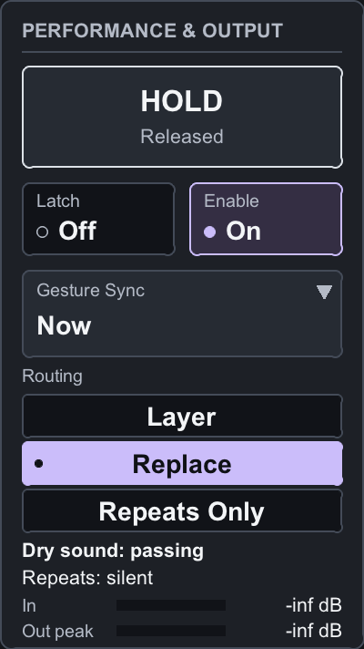 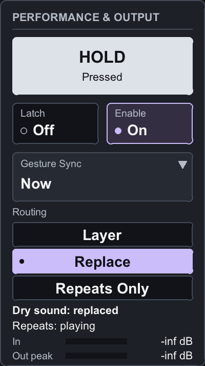
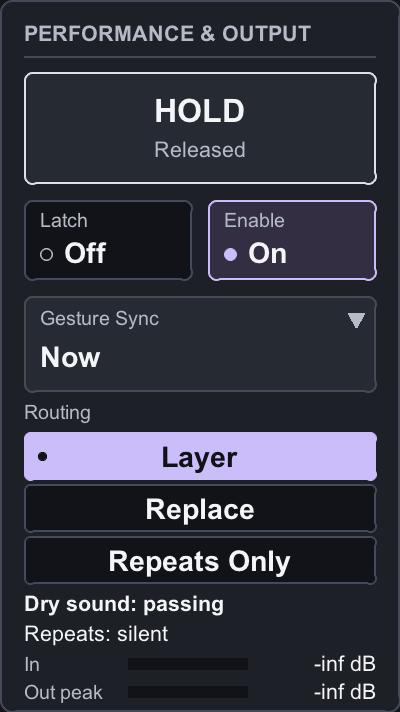 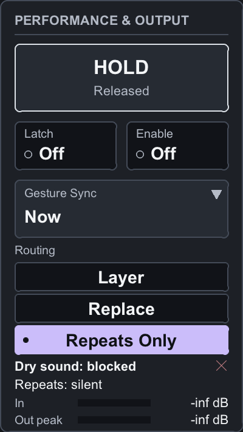

| Control | Values | What it does |
|---|---|---|
| HOLD | press / release | Captures the moment you press and repeats until you let go. The button reads *Pressed* or *Released* |
| LATCH | Off / On | Keeps a manual repeat going without holding. Latching a repeat you are already holding keeps its sound; letting go of HOLD while Latch is on changes nothing |
| ENABLE | Off / On | Off stops everything at once: the repeat, Latch, any promised start or stop. On waits for a new press or the next chance; a HOLD still pressed from before needs a fresh press |
| GESTURE SYNC | Now, 1/16, 1/8, 1/4, Bar | Makes your presses and releases land on the next such boundary (section 1.10) |
| ROUTING | Layer, Replace, Repeats Only | How the repeats meet the dry sound (below) |

**The three routings**

| Routing | Waiting | While a repeat plays | Repeat faded to silence | Enable off |
|---|---|---|---|---|
| **Layer** | dry | dry plus the repeats | dry | dry |
| **Replace** | dry | repeats only | silence | dry |
| **Repeats Only** | silence | repeats only | silence | silence |

Layer adds the repeats on top of the dry sound, so the level rises while they play. Replace swaps
the dry sound for the repeats and brings it back when they end. Repeats Only never lets the dry
sound through, which makes it the routing for a send: put Raja on a return track with Repeats Only
and set the amount with the send level. Changing routing never recaptures.

Under the buttons two lines say what each path is doing: *Dry sound: passing*, *replaced* or
*blocked* (with a cross), and *Repeats: playing* or *silent*. The **In** and **Out peak** meters
show levels on a 60 dB scale; an output at or above 0 dB adds a cross.

**Enable is not bypass.** Raja's own Enable keeps the routing: with Repeats Only the return stays
silent, and the panel keeps saying *Dry sound: blocked*. REAPER's bypass button takes Raja out of the
chain, so the dry sound would pass through the return. Use Enable to switch Raja off musically.

### 1.9 Repeating the randomness

With **Pattern** at 1, 2 or 4 bars the dice are no longer rolled fresh. Every chance to capture at a
given place in the pattern gets the same yes or no every time the pattern comes round, and every
capture at a given place draws the same slice sizes, while the sound it captures is whatever is
playing at that moment. A two-bar drum loop then gets the same stutters in the same places on every
pass, played on the hits that are there now. Looping in REAPER and rendering offline give the same
decisions as playback.

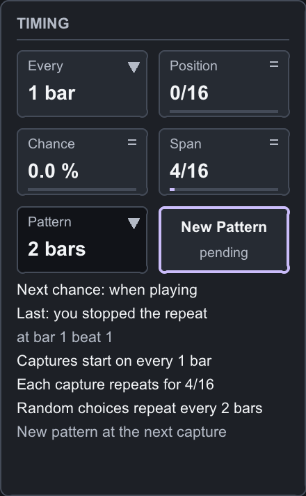

**New Pattern** draws a different set of decisions. It is applied from the next automatic decision, so
a repeat already playing is never changed; the Timing card says *New pattern at the next capture*
until then. The pattern is saved with the project. Chance 0 % and 100 % keep their exact meaning with
a pattern, Spread 0 stays fixed, and changing Slice, Spread or Straight Only keeps the pattern while
changing which sizes come out of it. Your own presses are always fresh: a pattern only steers the
automatic captures, and the Timing card says *Pattern: automatic captures only* while you hold.

### 1.10 Playing it by hand

Press **HOLD** while something worth repeating is passing, or click **Latch** to keep it. The repeat
starts on the moment of the press, not before it. While a manual repeat plays, Span is ignored and
the automatic chances are skipped; after you let go, automation resumes at the next chance.

**Gesture Sync** lets you press early and land musically. With 1/16, 1/8, 1/4 or Bar, a press starts
the repeat on the next such boundary and a release stops it on the next one; the header says *Armed
· starts at bar 3 beat 1* and then *Letting go at bar 5 beat 1*, and the timeline marks the promised
boundary. The capture happens at the boundary, so what you hear is the sound from that instant.

- A press let go before its boundary is simply cancelled; nothing plays.
- Pressing again while a stop is pending cancels the stop and keeps the same sound.
- Changing Gesture Sync does not move a boundary already promised.
- Enable off cancels everything at once.
- If the transport is stopped there is no musical time to wait for: presses act at once, and the
  footer says so. Raja then uses the project tempo (or 120 BPM if REAPER gives none).

Starting and stopping never clicks: the repeats fade in and out over three milliseconds while the
dry sound crosses over the other way, which is far too short to hear as a fade.

### 1.11 Changing a setting while it plays

| You change | What happens |
|---|---|
| Every, Position, Chance | Future chances only; the repeat that is playing is left alone |
| Span | The next capture; the current end stays where it was |
| Slice, Straight Only, Spread, Change | At the next repeat, on the same recording |
| Pitch | At the next repeat, keeping the Fall accumulated so far |
| Fall, Fade | Future steps only; nothing already fallen or faded is undone |
| Repeat Level, Filter, Center, Width | At once |
| Routing | At once, on the same repeat |
| Gesture Sync | The next press or release; a boundary already promised is kept |
| Pattern, New Pattern | The next automatic capture |
| Enable off | Everything stops at once, including promised starts and stops |

### 1.12 Transport, tempo and meter

- **Stop** ends the repeat and switches Latch off. Pressing HOLD while stopped still works, at the
  project tempo.
- **Play**, a **seek**, a **loop wrap**: the repeat ends, presses are cleared, and the schedule lines
  up with the new position without catching up on chances that were skipped over. If the new position
  is itself a chance, it may capture.
- **Tempo changes** are followed: the schedule and the automatic ends follow the new tempo, and from
  the next repeat each slice is measured at the new tempo. The captured sound is never replaced
  because of tempo.
- **A time-signature change on a bar line** keeps the repeat and your Latch; bar-based settings
  follow the new bars from the marker. Raja learns about a meter change when playback passes it; if a
  project changes meter before the point where you press play, bar-based Every, Pattern and Gesture
  Sync *Bar* may be offset until playback passes a marker.

### 1.13 The presets

Each preset is a starting point: load it, listen, then move whatever you like. The values below are
the ones the preset sets; anything not mentioned stays at the default (Straight Only on, Spread 0 %,
Pitch 0, no Fall or Fade, Filter off, Pattern Fresh).

**Hold to play.** These leave Chance at 0 %, so nothing happens on its own: press **HOLD** (or click
Latch) while something worth repeating is passing.

- **Stutter (HOLD)**: Slice 1/16, Replace, Gesture Sync Now. The plain stutter, and the state of a
  new instance: the repeat starts the moment you press and stops the moment you let go.
- **On the Beat (HOLD)**: the same with Gesture Sync 1/4. Press a little before the beat you want and
  let go a little before the next downbeat: the repeat starts exactly on the beat and stops exactly on
  the downbeat, and the header shows both promises.
- **Bar Loop (HOLD)**: Slice 1/1, Gesture Sync Bar, Replace. Press anywhere in a bar: from the next
  downbeat the whole bar (in 4/4) repeats until you let go, and the stop lands on a bar line too.
- **Buzz Tone (HOLD)**: Slice 1/256, Replace, Gesture Sync Now. The repeats are so short that they
  fuse into a tone: at 120 BPM a 1/256 slice repeats 128 times a second. Lower Pitch to lower the
  tone.
- **Octave Down (HOLD)**: Slice 1/8, Pitch −12, Gesture Sync 1/8, Replace. The sound under your
  finger plays an octave down at half speed, entering and leaving on eighth notes.
- **Falling Tail (HOLD)**: Slice 1/8, Pitch −7, Fall 2, Fade 2 dB, Repeat Level −3 dB, Layer, Gesture
  Sync 1/8. A tail that falls and dies away over the dry sound; let go when it has gone far enough.
- **Filter Sweep (HOLD)**: Slice 1/16, Filter on, Center 1 kHz, Width 1.5 octaves, Replace, Gesture
  Sync Now. Hold, then drag Center (or click Latch first and sweep with the mouse free).
- **Triplet Shuffle (HOLD)**: Slice 1/8T, Straight Only off, Spread 25 %, Change Each Slice, Gesture
  Sync 1/8, Replace. Every repeat draws a size between 1/32T and 1/2T, straight or triplet, so the
  stutter shuffles against the grid.
- **Glitch Burst (HOLD)**: Slice 1/64, Straight Only off, Spread 60 %, Change Each Slice, Gesture
  Sync Now, Replace. A burst of sizes from 1/256 to 1/2T for as long as you hold.

**Scheduled.** These capture on their own; the header and the timeline show when.

- **Stutter Beat 3**: Every 1 bar, Position 8/16, Chance 100 %, Span 4/16, Slice 1/16, Replace.
  Beat three of every bar becomes four sixteenth-note repeats, and the dry sound returns on beat four.
- **Half-Bar Chop**: Every 1/2, Chance 60 %, Span 4/16, Slice 1/16, Replace. Beats one and three
  each have a 60 % chance of turning into a beat of sixteenth repeats.
- **Triplet Roll**: Every 1 bar, Position 12/16, Chance 70 %, Span 4/16, Slice 1/16T, Straight Only
  off, Replace. Beat four usually becomes a roll of six triplet sixteenths.
- **Drum Fills**: Layer, Repeat Level −12 dB, Every 1 bar, Position 12/16, Chance 20 %, Span 2/16,
  Slice 1/32, Fade 2 dB. About one bar in five gets a quiet eighth-note stutter on beat four under the
  dry drums, each of its four repeats a little quieter than the one before.
- **Glitch Variation**: Every 1/8, Chance 45 %, Span 6/16, Slice 1/32, Spread 40 %, Change Each
  Slice, Straight Only off, Replace. A chance comes every eighth note and almost half of them capture,
  so a new capture usually replaces the previous one before its Span is over, and every repeat draws a
  fresh size between 1/256 and 1/4.
- **Locked Groove**: Pattern 1 bar, Every 1/8, Chance 30 %, Span 2/16, Slice 1/32, Spread 30 %,
  Change Episode, Replace. The same eighths stutter in every bar, each with the same slice size, on
  whatever the loop is playing there now.
- **Returning Fill**: Pattern 2 bars, Every 1/4, Chance 35 %, Span 2/16, Slice 1/32, Spread 50 %,
  Change Episode, Replace. About a third of the beats capture, and the same beats capture with the
  same sizes on every pass of the two bars. Click New Pattern while the loop plays until you like
  where the fills fall; the choice is saved with the project.
- **Falling Echo**: Every 1 bar, Chance 100 %, Span 8/16, Slice 1/16, Pitch −12, Fall 2, Fade 3 dB,
  Replace. Each bar captures its downbeat: the first repeat plays an octave down and lasts an eighth
  note, and each following repeat is two semitones lower, a little longer and 3 dB quieter, until the
  dry sound returns on beat three.
- **Tape Slow**: Every 2 bars, Position 8/16, Chance 100 %, Span 8/16, Slice 1/4, Pitch −5, Fall 3,
  Replace. Every other bar, beats three and four slow down: a quarter-note slice starts five
  semitones low and the next repeat falls three more, stretching as it goes.
- **Filtered Ghost**: Layer, Repeat Level −6 dB, Filter on, Center 2 kHz, Width 2 octaves, Every
  1 bar, Position 4/16, Chance 50 %, Span 4/16, Slice 1/16, Fade 2 dB. Half the bars get a thin,
  fading sixteenth stutter on beat two under the dry sound.
- **Send Return**: Repeats Only, Every 1 bar, Position 12/16, Chance 50 %, Span 4/16, Slice 1/16,
  Fade 1 dB. For a return track: send the drums to it and set the amount with the send level. Beat
  four stutters on half the bars, and between repeats the return is silent, so the dry drums are heard
  only from their own track. Enable off keeps the return silent, where REAPER's bypass would let the
  dry send through.

---

## Part 2 — How Raja is built

This part is for the curious and for anyone who wants to modify the file. Everything here was
measured while building the plug-in.

### 2.1 One file, two threads of work

`Raja.jsfx` is a REAPER JSFX effect written in EEL2. The audio sections (`@init`, `@block`,
`@sample`, `@serialize`) run on REAPER's audio thread; the interface (`@gfx`) runs on the UI thread
at 30 frames per second, reads the engine's state and writes only the parameter values and, when you
choose a preset, a one-word request that the audio thread answers by setting eighteen parameters at
once. The twenty-two parameters are ordinary sliders, hidden from REAPER's generic view, which is what
makes automation, controller mapping and project state free. The presets are a table in the file,
and preset 0 equals the slider defaults, so a new instance is never "edited" by construction.

### 2.2 Musical time

REAPER tells the plug-in, once per audio block, the position in beats, the tempo and the time
signature. Raja turns every musical instant it needs (the next chance, the end of a Span, a promised
boundary, a Change tick) into a beat value and compares it against the beat of each sample, so
events land on their exact sample and never drift with the block size. When several things fall on
the same instant the order is fixed: a stop or disable first, then a promised press or release, then
the end of a Span, then a chance to capture, then a change of slice size; a press exactly on a chance
wins over the chance.

Whether the transport is running is judged from the beat position moving consistently from block to
block, not from the host's play flag alone, so offline renders behave like playback. A jump in
position is a relocation; a stop is the position freezing. Bars are counted from the start of the
project with the current time signature, and re-anchored when a meter change is passed while
playing. REAPER exposes no bar map to a plug-in, which is the source of the limitation in 1.12.

### 2.3 Capture and repeats

A capture writes the incoming sound into a buffer from the instant of the capture, up to one whole
note. Each repeat reads a prefix of that buffer, the slice, from the beginning; the first repeat
therefore reads the sample that was written a moment earlier and is the live sound. Pitch is a
playback rate: at −12 st the read position advances half a sample per sample, through a four-point
Hermite interpolation. When a repeat reaches the end of its slice the fractional remainder is carried
into the next one, so long runs do not drift. The slice length in samples is worked out at every
repeat from the current tempo; the recording itself is kept.

### 2.4 Joins without clicks

Every seam is a raised-cosine crossfade of three milliseconds. When a repeat reaches its slice end,
the continuation of the recording fades out under the start of the next repeat, each at its own
level and speed, so Fade and Fall steps are smoothed as well. A capture fades in while the dry sound
fades out (Replace) or from silence. A capture that replaces one still playing keeps the old repeat
as a fading ghost for those three milliseconds, and a capture interrupted during its own fade-in is
carried at its current weight. The release is the same fade in reverse. The crossfade never exceeds a
quarter of a repeat, so very short slices keep their buzz.

### 2.5 Randomness that repeats

Raja never stores a sequence of random numbers. A pattern is a single number, its identity, and every
decision is a hash of that identity and of the position in the pattern where the decision is made (in
256th notes), plus, for slice sizes, the index of the repeat. The same place in the pattern always
gives the same number, however you got there: looping, seeking, rendering. Each capture keeps the
identity it started with, so New Pattern can wait for the next one. Fresh mode uses ordinary random
numbers.

The slice choice is kept as one number between 0 and 1 for the whole capture and mapped onto the
list of allowed sizes at every repeat, so changing Slice, Spread or Straight Only while a pattern
plays re-maps the same decision instead of rolling a new one.

### 2.6 Filter and levels

The band filter is a second-order high-pass at the lower edge and a second-order low-pass at the
upper edge, both Butterworth, recomputed when Center or Width move and reset when the filter is
switched on and when a capture starts from silence or dry. Repeat Level changes ramp over five
milliseconds; Fade steps are applied at each repeat and smoothed by the join crossfade. The dry path
is the current input sample, untouched.

### 2.7 State

REAPER saves the twenty-two parameters. Raja itself saves only its pattern identity and the index of
the chosen preset, twelve bytes. A loaded project never re-applies the preset: the parameters come
back exactly as saved, and the *edited* marker is worked out by comparing them with the preset's
values, so it is never stored and never wrong. Hold, Latch and New Pattern are cleared when a project
loads; the captured sound is never written anywhere.

### 2.8 Cost

The engine does a handful of comparisons, one buffer write and one or two interpolated reads per
sample, plus four biquad stages when the filter is on. A worst-case render at 48 kHz (Chance 100 %,
eighth-note chances, varying slices, pitched and falling, filter on, Layer) costs about 28 ms of
processing per second of audio on an Apple M1 Max, roughly thirty-five times faster than real time,
measured as the extra time a 250-second render takes over a 10-second one.

### 2.9 How it was verified

Nothing in this manual is asserted from reading the code. Automated checks drive REAPER from the
command line, render through the plug-in and measures the audio against a model of the engine
built from the design, and a live session drives the transport and the panel with real mouse
gestures:

- With Chance at 0 % the output equals the input exactly, sample for sample, both channels.
- A signal whose every sample encodes its own index lets a render be decoded into captures, repeats
  and read positions. Captures at Position 8/16 land on the exact sample of beat three of every bar;
  Span ends, slice edits, Straight Only mapping, triplet lengths, Pitch, Fall, its −48 st floor,
  Fade and its reset, the three routings, Enable in Repeats Only, a tempo change mid-repeat, a
  meter change mid-repeat, 6/8 and 96 kHz all match the model to within a few millionths of full
  scale, the precision of the rendered file.
- Gesture Sync starts and stops on the exact boundary, a press let go early is cancelled, pressing
  again during a pending stop keeps the sound, Latch keeps a repeat when HOLD is released, and
  chances during a hold are skipped and resume strictly after it.
- Two renders with the same pattern identity are bit-identical; the same identity on different audio
  makes the same decisions; a two-bar pattern repeats bars one and two in bars three and four; a looped
  bar in live playback makes the same decision at the same place on every pass.
- Stop ends the repeat and clears Latch; play, seek and loop wrap relocate without catching up; a
  saved project holds only the version and the identity, and a reload keeps the identity but not the
  gestures or the sound.
- The panel was tested with real mouse gestures: fields step and reset, Shift is fine, right-click
  lists and the Pitch list set values, toggles and routing buttons switch, HOLD is pressed while the
  button is down and releases itself if the window stops drawing.
- Each of the twenty presets, chosen from the list with the mouse, sets its eighteen values exactly
  as the table in the file says; the open list swallows clicks meant for controls underneath; an edit
  marks the preset edited and choosing it again clears the marker; the wheel steps through the list;
  a saved project restores the preset index and the edited values without re-applying the preset.
- Every check was first shown to go red on a planted defect: a late Span end, a missing skip during a
  hold, a leaking Repeats Only, a lost fractional carry, a broken triplet mapping, a Fade that did not
  reset, dice rolled instead of hashed, a second slice choice at a capture.
- The joins were measured on a 24-bit chord loop at 90 BPM through a scripted performance: the
  largest sample-to-sample jump in the output equals the loop's own, where the first build produced
  jumps up to eleven times larger.

---

## Part 3 — Licence and provenance

### 3.1 Licence

Raja is released under the **MIT License**. The full text is also embedded at the top of `Raja.jsfx`:

```
MIT License

Copyright (c) 2026 Michele Ibba

Permission is hereby granted, free of charge, to any person obtaining a copy
of this software and associated documentation files (the "Software"), to deal
in the Software without restriction, including without limitation the rights
to use, copy, modify, merge, publish, distribute, sublicense, and/or sell
copies of the Software, and to permit persons to whom the Software is
furnished to do so, subject to the following conditions:

The above copyright notice and this permission notice shall be included in
all copies or substantial portions of the Software.

THE SOFTWARE IS PROVIDED "AS IS", WITHOUT WARRANTY OF ANY KIND, EXPRESS OR
IMPLIED, INCLUDING BUT NOT LIMITED TO THE WARRANTIES OF MERCHANTABILITY,
FITNESS FOR A PARTICULAR PURPOSE AND NONINFRINGEMENT. IN NO EVENT SHALL THE
AUTHORS OR COPYRIGHT HOLDERS BE LIABLE FOR ANY CLAIM, DAMAGES OR OTHER
LIABILITY, WHETHER IN AN ACTION OF CONTRACT, TORT OR OTHERWISE, ARISING FROM,
OUT OF OR IN CONNECTION WITH THE SOFTWARE OR THE USE OR OTHER DEALINGS IN
THE SOFTWARE.
```

The licence covers `Raja.jsfx` as a whole: the engine, the interface and this manual.

### 3.2 What is in the file and where it came from

Every line of `Raja.jsfx` was written for Raja; no code from any other project is incorporated. The
design follows a written product concept prepared for this plug-in, and uses published techniques
from their descriptions: biquad filter design (Robert Bristow-Johnson, *Audio EQ Cookbook*),
four-point third-order Hermite interpolation (Olli Niemitalo, 2001) and Park–Miller multiplicative
congruential mixing (Park and Miller, 1988). The slice ladder, the timing model, the pattern scheme,
the graphics and the text are original. Nothing from any commercial effect is reproduced.

### 3.3 Names

"Raja" is the plug-in's own name and is not connected to any product of the same name.
