# Satya — User Manual

Satya is a polyphonic wavetable synthesizer for REAPER. It is one file, `Satya.jsfx`, with
153 factory presets inside it. This manual has three parts: how to play and program it, how
it is built, and the licence it comes with.

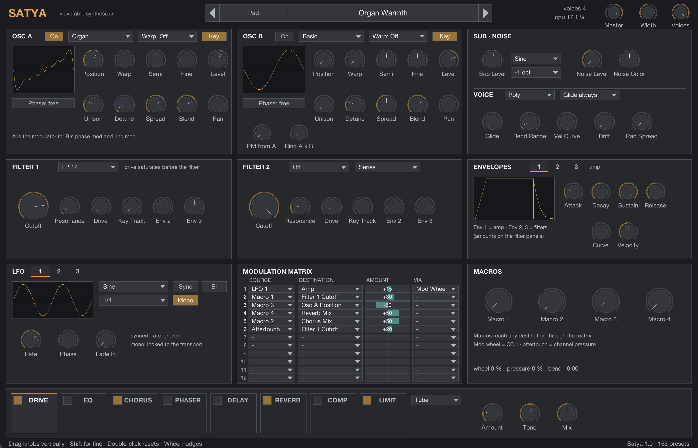

---

## Part 1 — Playing and programming Satya

### 1.1 Installing and loading

Copy `Satya.jsfx` into REAPER's `Effects` folder (or a subfolder of it), or symlink it there.
Open the FX browser on a track, choose **JS: Satya**, and send the track MIDI from a keyboard or
a MIDI item. REAPER rescans the folder on start; if the plug-in does not appear, use
*Options → Preferences → Plug-ins → ReaScript / JSFX → re-scan*.

Satya needs no other files. Presets, wavetables and graphics are all inside the one file.

### 1.2 The window at a glance

The panel is fixed at 1400 × 900 and shows the whole instrument at once, top to bottom in signal
order: sources, filters and envelopes, modulation, effects.

| Row | Panels |
|---|---|
| Header | Preset browser, voice and CPU readouts, Master, Width, Voices |
| 1 | OSC A, OSC B, SUB · NOISE and VOICE |
| 2 | FILTER 1, FILTER 2, ENVELOPES |
| 3 | LFO, MODULATION MATRIX, MACROS |
| 4 | The effects strip |
| Status line | The control under the pointer and its value |

**Working the controls**

- Drag a knob **up or down** to change it. Hold **Shift** for fine control.
- **Double-click** a knob to return it to its default.
- The **mouse wheel** nudges a knob in small steps (Shift for smaller steps).
- Buttons with a small triangle open a **menu**; the current choice is ticked.
- Toggles light up amber when on.
- While the pointer is over a control, the **status line** at the bottom names it and shows its
  value in real units: Hz for cutoffs, dB for levels, ms or s for times, semitones and cents for
  tuning.

Every control is also a REAPER parameter, so it can be automated with envelopes, mapped to a
controller with *Param → Learn*, and it is saved with the project.

### 1.3 Presets


The browser in the header has four parts:

- **◀ ▶** step to the previous or next preset, in library order.
- The **category** button opens a menu of the sixteen categories.
- The **name** button opens a menu of the presets in the current category.
- An asterisk after the name means the preset has been edited since it was loaded.

Presets can also be selected from a keyboard or a MIDI item with a **program change**. The
first 128 presets answer to programs 0–127 directly; the presets after that need a **bank select**
first (CC 0 or CC 32 with value 1, then the program number minus 128). The listening project in
`demo/` does exactly this on every track.

Loading a preset resets every control, including the effects, and silences any sounding notes.
To keep your own sounds, save them as REAPER FX presets (the *+* button in the FX window) or
simply save the project: the state of every control is stored with it.

**The categories**

| Category | What lives there |
|---|---|
| Init | Starting points: saw, square, wavetable, FM, noise |
| Bass | Subs, 808s, reese, acid, growls |
| Lead | Mono and poly leads, sync, formant, brighter and darker |
| Pad | Strings, choirs, evolving and wide pads |
| Keys | Pianos, electric pianos, organs, clavs, gated keys |
| Pluck | Short decays, sequences' best friends |
| Mallet | Marimba, kalimba, vibraphone, xylophone, glockenspiel |
| Bell | Bells, tines, chimes, pans |
| Sequence | Tempo-locked gates, runners, stutters |
| Brass | Poly brass, horns, stabs |
| Atmosphere | Slow, wide, long tails |
| Texture | Evolving and granular-like movement |
| FX | Risers, impacts, sweeps, transitions |
| Performance | Sounds written for the wheel, pressure and expression |
| Experimental | Drones and machines |
| Drum | Kicks, snare, hat, clap, tom, blip |

**How the presets are wired.** Every factory preset follows one convention, so a controller or
a hand on the wheel does the same kind of thing on every sound:

| Control | What it does across the library |
|---|---|
| Mod wheel | Vibrato, or the sound's signature movement |
| Aftertouch | Brightness (filter opening), or more vibrato |
| Macro 1 — *Tone* | Brightness: filter cutoff |
| Macro 2 — *Motion* | Movement: LFO depth or rate, detune, resonance |
| Macro 3 — *Character* | Wavetable position, warp, drive |
| Macro 4 — *Space* | Reverb, delay or chorus amount |

### 1.4 Oscillators

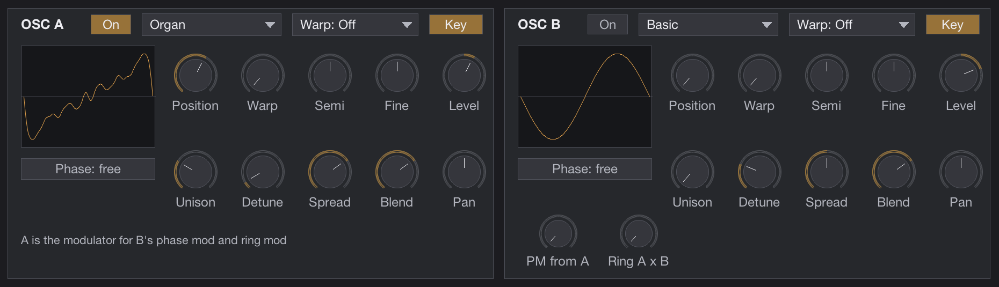

Satya has two identical wavetable oscillators. Each plays one of sixteen **wavetables**; a
wavetable is a set of eight waveforms, and **Position** morphs smoothly through them. The
display shows the exact waveform being played, including the warp.

| Control | Meaning |
|---|---|
| On | Enables the oscillator |
| Wavetable menu | Basic, Warm, Pulse, FM One, FM Two, FM Even, Sync, Vowel, Organ, Bell, Digital, Fold, Grit, Air, OddEven, Decay |
| Warp menu | How the waveform is reshaped: Off, Bend, Sync, Mirror, Quantize, Formant |
| Key | Keyboard tracking on or off. Off gives a fixed pitch, which is how the drum presets work |
| Position | Where in the wavetable you are, 0 to 1 |
| Warp | How much of the warp is applied |
| Semi, Fine | Tuning in semitones (±36) and cents (±100) |
| Level | Output level in dB |
| Unison | 1 to 8 copies of the oscillator |
| Detune | How far apart the copies are tuned |
| Spread | How far apart they are panned |
| Blend | Level of the outer copies relative to the centre |
| Pan | Position of the whole oscillator |
| Phase: reset / free | Whether every note starts the waveform at the same point (reset: consistent attack, punchy) or wherever it happens to be (free: softer, no two notes identical) |

**The wavetables.** Basic holds the classic shapes (sine, triangle, saw, square, pulse widths).
Warm and Pulse are analogue-flavoured variations. FM One, FM Two and FM Even are frequency-
modulation spectra at rising indices. Sync is a hard-sync sweep. Vowel moves through vocal
formants. Organ is drawbar registrations. Bell and Digital are inharmonic and bright. Fold and
Grit are wavefolded and gritty. Air is breathy and thin. OddEven moves between odd and even
harmonics. Decay is a plucked-string spectrum that gets darker along the table.

**The warps.** *Bend* skews the waveform (pulse-width for a square, brightness for a saw).
*Sync* plays the waveform faster and resets it at the original pitch, the classic hard-sync
sweep. *Mirror* folds the second half back. *Quantize* steps the waveform, a lo-fi effect that
deliberately aliases. *Formant* keeps the pitch and moves a resonant window instead, a vocal
effect. Warp amount is a favourite destination for envelopes and macros.

**OSC B only.** *PM from A* lets oscillator A phase-modulate B (FM-style timbres: the result
depends on both wavetables, and Reset phase makes it stable). *Ring A × B* multiplies the two,
for bells and metallic tones.

### 1.5 Sub, noise and voice

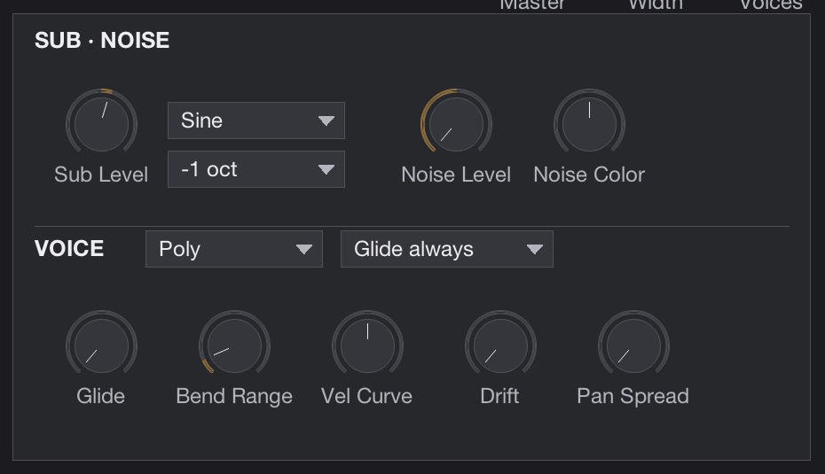

The **sub** is a clean sine, triangle or square one or two octaves below the note. The **noise**
source is white through a colour control: negative is darker, positive is brighter. Noise level
is a good envelope destination for breath and attack transients.

The **VOICE** section decides how notes are played:

| Control | Meaning |
|---|---|
| Poly / Mono / Legato | Chords; one note at a time with every note retriggering the envelopes; one note at a time where overlapping notes glide without retriggering |
| Glide always / Glide legato | Whether glide applies to every note or only to overlapping ones |
| Glide | Glide time, 5 ms to 5 s. The time is constant whatever the interval |
| Bend Range | Pitch-bend range, 0 to 24 semitones (default 2) |
| Vel Curve | Bends the velocity response: negative makes soft playing louder, positive makes it more dynamic |
| Drift | Slow random detuning of each voice, the way analogue oscillators wander |
| Pan Spread | Alternate notes left and right. In mono modes it alternates note by note too |
| Voices (header) | Polyphony, 1 to 16. Set 1 for drums and one-shots |

Satya has sixteen voices. When more notes arrive, it steals released notes first, then the
oldest, and fades the stolen note over a few milliseconds so stealing never clicks. The sustain
pedal (CC 64) holds notes as expected.

### 1.6 Filters

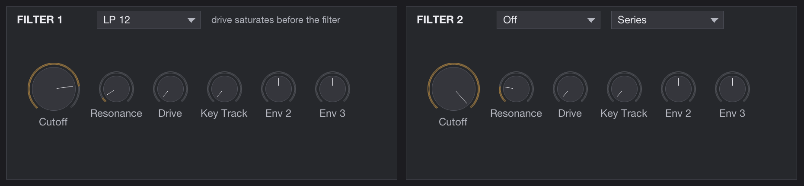

Two filters, each with nine types:

| Type | Character |
|---|---|
| LP 12 / LP 24 | Low-pass, 12 or 24 dB per octave. 24 is the classic synth slope |
| HP 12 / HP 24 | High-pass, for thinning or removing the low end |
| BP 12 / BP 24 | Band-pass, for vocal and telephone timbres |
| Notch | Removes a band; sweep it for phaser-like movement |
| Ladder | A four-pole ladder with saturation inside the loop; screams at high resonance |

| Control | Meaning |
|---|---|
| Cutoff | The corner frequency (the status line shows it in Hz) |
| Resonance | Peak at the corner; the ladder self-oscillates near the top |
| Drive | Saturation before the filter; the ladder saturates inside it as well |
| Key Track | How much the cutoff follows the keyboard: 0 stays put, 1 follows fully |
| Env 2, Env 3 | How much envelopes 2 and 3 open (or, negative, close) the filter |

**Routing** (on FILTER 2): *Series* sends everything through filter 1 then filter 2. *Parallel*
runs both side by side and the small **mix** knob balances them. *Split A/B* sends oscillator A
and the sub through filter 1, and oscillator B and the noise through filter 2, so each half of
the sound has its own filter.

### 1.7 Envelopes

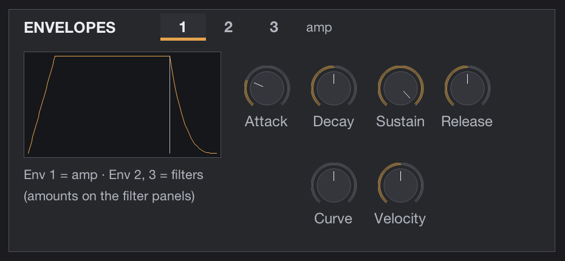

Three ADSR envelopes, selected with the tabs. **Envelope 1 is the amplitude envelope**, always.
Envelopes 2 and 3 are free: their amounts on the filter panels open the filters, and they can go
anywhere through the matrix.

| Control | Meaning |
|---|---|
| Attack | 0.5 ms to 20 s |
| Decay, Release | 1 ms to 20 s |
| Sustain | Level held while the key is down |
| Curve | Shape of the segments: negative is snappier (fast start, slow end), positive is the reverse |
| Velocity | How much velocity scales the envelope's output |

For drums and one-shots, set Release equal to Decay so a short pad hit still plays the whole
decay.

### 1.8 LFOs

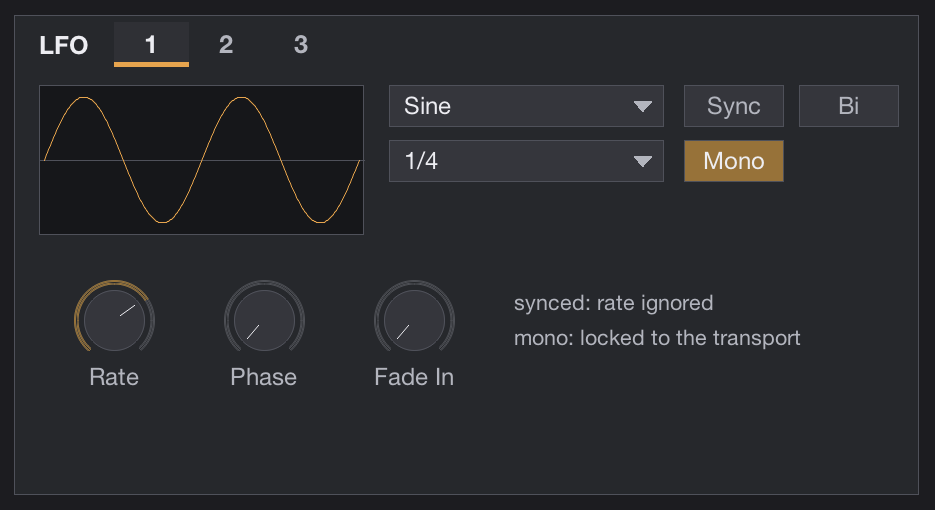

Three LFOs, selected with the tabs. The display shows one shape at the current phase.

| Control | Meaning |
|---|---|
| Shape | Sine, Triangle, Saw Up, Saw Down, Square, Sample & Hold, Smooth Random, Pulse |
| Sync | Off: free rate in Hz (0.01 to 50). On: a musical division of the project tempo |
| Division | 4/1 down to 1/32, with dotted and triplet values |
| Poly / Mono | Poly: each note has its own LFO, starting at Phase when the note starts. Mono: one LFO shared by all notes; when synced it is locked to the transport, so a gate lands on the beat wherever you start |
| Bi / Uni | Bipolar swings both ways around the centre; unipolar goes from 0 upward, which is what you want for gates and tremolo |
| Rate | Free-running rate |
| Phase | Starting point of the cycle |
| Fade In | Time for the LFO to reach full depth after the note starts, for delayed vibrato |

An LFO does nothing until it is routed somewhere in the matrix. Its **rate** is itself a
destination, so the wheel or a macro can speed a wobble up.

### 1.9 The modulation matrix

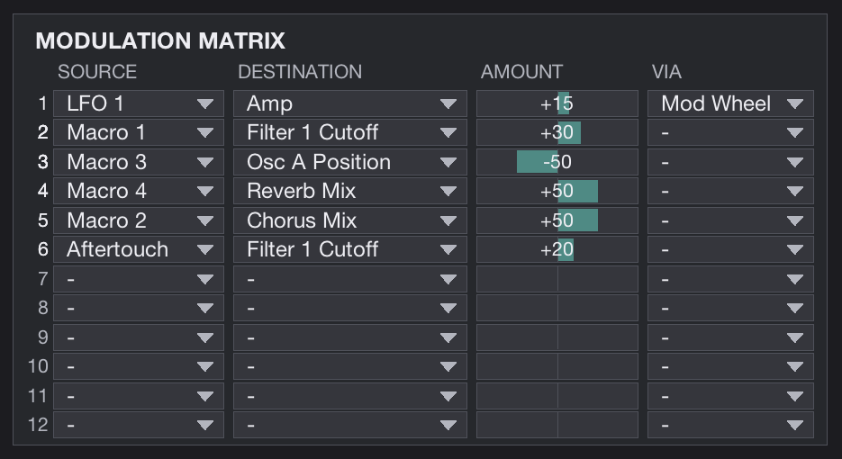

Twelve rows. Each row takes a **source**, multiplies it by an **amount**, optionally by a second
**via** source, and adds the result to a **destination**. Rows with a source and a destination
are shown in full; empty rows are dimmed.

**Sources:** Env 1–3, LFO 1–3, Velocity, Key Track, Mod Wheel, Aftertouch, Pitch Bend,
Macro 1–4, Random (a new value for every note, for round-robin variation), Constant (always 1,
for fixed offsets).

**Destinations:** pitch (all, A, B), oscillator position, warp, level, pan, detune and fine tune
for each oscillator, PM amount, ring mod, sub and noise level, cutoff, resonance and drive of
each filter, amp, pan, the rate of each LFO, the amount of drive, chorus, delay, delay feedback,
reverb and phaser, glide time, and the attack, decay and release of envelope 1.

The **amount** slider is bipolar: drag right for positive, left for negative; double-click to
zero it. Pitch amounts are in fractions of two octaves, so 0.05 is about one semitone and 0.008
is a gentle vibrato.

**Via** multiplies the row by another source. *LFO 1 → Cutoff via Mod Wheel* is a wobble that
only appears as the wheel comes up; *LFO 1 → Amp via Macro 2* is a tremolo whose depth is on a
macro. The factory presets use via with the macros a lot, which is why the macros start half-way
up on those sounds: turn the macro down for none, up for more.

### 1.10 Macros and performance controls

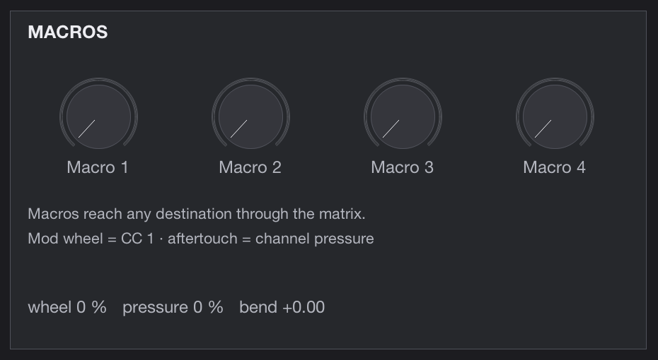

Four macro knobs that do nothing by themselves: route them in the matrix to whatever you want
to move with one hand. The line under them shows the live mod wheel, channel pressure and pitch
bend. Satya listens to CC 1 (wheel), channel aftertouch, pitch bend, CC 64 (sustain), CC 120 and
123 (all notes off) and CC 121 (reset controllers).

### 1.11 Effects

The strip along the bottom holds eight effects in a fixed order: Drive, EQ, Chorus, Phaser,
Delay, Reverb, Compressor, Limiter. Each button has a small switch that turns the effect on or
off; clicking the name shows its controls on the right.


**Drive.** A waveshaper with four flavours: *Soft* (tape-like), *Hard* (clipping), *Fold* (the
wave folds back on itself, harsh and bright) and *Tube* (asymmetric, adds even harmonics).
Amount is 0 to 30 dB of gain into the shaper, Tone darkens the result, Mix blends it with the
dry sound. It runs at twice the sample rate so it does not alias.

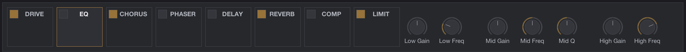

**EQ.** Low shelf (40–640 Hz), a peak band (200 Hz–8 kHz with a Q control) and a high shelf
(1.5–16 kHz), ±18 dB each.


**Chorus.** *Chorus* is a two-voice stereo chorus; *Ensemble* is a three-voice, two-rate
ensemble, thicker and slower-moving. Rate, Depth and Mix.


**Phaser.** Six stages with feedback. Rate (0.02–5 Hz), Depth (sweep width in octaves), Feedback,
Center and Blend. Blend at 50 % gives the deepest notches; beyond it the effect gets thinner
again.

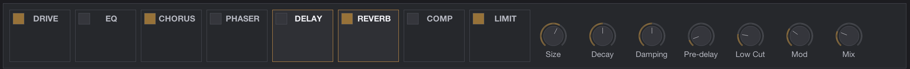

**Delay.** Tempo-synced (4/1 to 1/32, dotted and triplet) or free (1 ms to 2 s), with
*Ping-pong* alternating repeats left and right. Feedback, Tone (a low-pass in the feedback
path), Low Cut (a high-pass in the same path, keeps repeats from muddying the low end) and Mix.

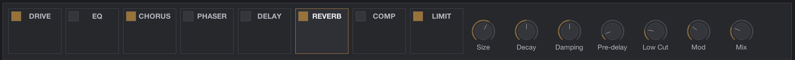

**Reverb.** Size, Decay (0.3 to 18 s), Damping (how fast the highs die), Pre-delay (up to 120 ms),
Low Cut, Mod (slow movement of the tail, for smoothness) and Mix. Decay above about 8 s together
with delay feedback makes tails that never end in a mix; the factory presets stay below that.


**Compressor.** Threshold, Ratio (1:1 to 20:1), Attack, Release and Makeup gain, with a live
gain-reduction readout. Use it to glue a stack or to pump a pad against its own attack.


**Limiter.** A peak limiter at the very end of the chain, on by default with its Ceiling at
−0.3 dB. It is a safety, not a level control: the factory presets are trimmed so that it barely
touches them. The readout shows how much gain it is taking off.

**Width** (header) narrows or widens the whole output: 0 is mono, 1 is as rendered, 2 is
extra wide. **Master** is the final level.

### 1.12 Recipes

- **Wobble bass.** Mono mode, LP 24, Cutoff low. LFO 1 Mono, Sync on, 1/4, Triangle, Uni. Matrix:
  LFO 1 → Filter 1 Cutoff 0.55, Mod Wheel → LFO 1 Rate 0.5. The wheel speeds the wobble up.
- **Delayed vibrato.** LFO 3 Sine, Mono, Rate around 5 Hz, Fade In 0.5 s. Matrix: LFO 3 → Pitch
  0.008 via Mod Wheel.
- **Velocity layers.** Two oscillators with different wavetables. Matrix: Velocity → Osc A Level
  −0.7, Velocity → Osc B Level 0.9, Constant → Osc B Level −0.9. Soft playing hears A, hard
  playing hears B.
- **Round robin.** Matrix: Random → Osc A Position 0.3, Random → Filter 1 Cutoff 0.15, Random →
  Pan 0.4. Repeated notes never sound identical.
- **Tempo gate.** LFO 1 Square, Mono, Sync, 1/16, Uni. Matrix: LFO 1 → Amp −0.8.
- **One-shot drum.** Osc Key off, Semi around −29 for a kick, Voices 1, Env 1 Decay = Release,
  Env 3 with zero sustain routed to Pitch 0.4 with a 40–200 ms decay for the pitch drop.

---

## Part 2 — How Satya is built

This part is for the curious and for anyone who wants to modify the file. Everything here was
measured while building the instrument, and the measurements and the reasoning are kept with
the development record.

### 2.1 One file, three threads of work

Satya is written in EEL2, REAPER's JSFX language. The file has the usual sections: `@init`
builds the wavetables and allocates memory, `@block` renders audio, `@sample` only copies the
rendered block out, `@gfx` draws the panel, `@serialize` stores the preset index and the tab
state. Every parameter is a slider (206 of them, hidden from REAPER's generic view with a `-`
prefix), which is what makes automation, controller mapping and project state free.

### 2.2 Voices and rendering

Voices are rendered **voice by voice, block by block** into a stereo accumulation buffer, with
each voice's state loaded into local variables for the duration of a block and written back
afterwards. Measured against the obvious alternative (a per-sample loop over all voices in
`@sample`), this is about twice as fast in EEL2, because the interpreter's cost is dominated by
memory access and function calls rather than arithmetic.

Control-rate work runs every 32 samples on a global grid: envelopes, LFOs, the matrix,
smoothing of every parameter, and the global effects' modulation. Continuous targets are
interpolated per sample, so a 32-sample chunk never steps. Blocks are split at note-on and
note-off, so note starts are sample-accurate whatever the host buffer size; controller data
waits for the next grid point. The same project renders identically at any buffer size.

Sixteen voices, plus eight "ghost" slots that let a stolen voice fade out over a few milliseconds
while its replacement starts. Voice stealing prefers released voices, quietest first, then the
oldest.

### 2.3 Oscillators

Each of the sixteen wavetables is eight frames of 2048 samples, generated at start-up from a
spectral recipe (a list of harmonic amplitudes and phases per frame) with an inverse FFT. Every
frame is stored at twenty **mip levels**, each with its spectrum cut off half an octave lower
than the previous one, and the oscillator picks the level whose highest harmonic stays below
half the sample rate for the current pitch. That is what makes the oscillators band-limited by
construction: a saw at C8 measures −117 dB of non-harmonic content. Position morphs between
adjacent frames by linear interpolation; unison is unrolled up to eight copies with per-copy
phase, gain and pan.

The warps reshape the read phase rather than the table. Sync and Formant, which introduce a
discontinuity when the master resets the slave, add a polynomial band-limited step (polyBLEP)
at the reset; Quantize is meant to alias and is documented as such; Mirror and Bend are handled
with an extra mip-level margin.

### 2.4 Filters

The state-variable filters are the trapezoidal-integrated design (Cytomic's), which is stable
at any cutoff and any modulation speed. The 24 dB modes are two stages with Butterworth
staging at zero resonance, so they measure as a proper 24 dB Butterworth when resonance is off.
The ladder is a four-pole cascade of topology-preserving one-poles with a rational tanh inside
the feedback loop, and its corner is capped at 0.45 of the sample rate. Both filters are
generated from one template so they cannot drift apart.

### 2.5 Effects

The drive runs at 2× oversampling through a polyphase IIR half-band pair (six first-order
all-pass sections) whose coefficients were designed numerically for this file; the dry path goes
through the same half-band round trip without shaping, so dry and wet stay phase-aligned at every
frequency. The EQ is three biquads from the standard cookbook formulae. The chorus and ensemble
are modulated delay lines with integrated LFO phases, so changing the rate sweeps instead of
jumping. The reverb is an eight-line feedback delay network with a Hadamard mixing matrix, four
input diffusers, per-line damping and two modulated read positions. The delay line holds two
million samples per channel so 4/1 at 60 BPM fits at 96 kHz. The compressor is a stereo-linked
soft-knee peak compressor; the limiter is a peak-hold limiter with instant attack and no
look-ahead.

### 2.6 Cleanliness

A constant 1e-18 is added to every block before the effects so no filter state can reach
denormal range with `ext_nodenorm` on. An 8 Hz one-pole removes DC from asymmetric warps and
ring modulation. Every random source (unison phases, drift, sample-and-hold, noise) is a
deterministic generator seeded at start, so the same MIDI renders the same audio to within that
1e-18 guard. Nothing on the audio path allocates, blocks or reads files.

### 2.7 Cost

On an Apple M1 Max at 96 kHz with 128-sample buffers (1333 µs per block): a six-note chord on a
typical preset takes about 510 µs per block; the worst factory pads with eight notes sit at
600–630 µs; a deliberately absurd sixteen-voice patch with sixteen unison copies on both
oscillators, the ladder, sub and noise is over budget at about 1600 µs, which is the documented
ceiling. The wavetable set is 42 MB and the delay and reverb memory about 36 MB, so an instance
uses roughly 80 MB.

### 2.8 How it was verified

Nothing in this manual is asserted from reading the code. An automated harness drives REAPER
from the command line, renders through the plug-in and measures the audio: pitch, spectra, aliasing,
filter corners and slopes, envelope timings, unison, every modulation route, stealing, MIDI
bursts, determinism, every effect, every one of the 206 controls (each must change the sound on
a measured zero noise floor), the GUI (pointer gestures injected and parameters read back),
project reload, and the whole factory library against a loudness and register envelope measured
from commercial instruments installed on the development machine, plus the 808 family against
fifteen measured samples. A separate script plants defects and requires the suites to go red.
Two independent review rounds were run, and their findings and dispositions are kept with the
development record.

---

## Part 3 — Licence and provenance

### 3.1 Satya's licence

Satya is released under the **MIT License**. The full text, which is also embedded at the end
of `Satya.jsfx`:

```
MIT License

Copyright (c) 2026 Michele Ibba

Permission is hereby granted, free of charge, to any person obtaining a copy
of this software and associated documentation files (the "Software"), to deal
in the Software without restriction, including without limitation the rights
to use, copy, modify, merge, publish, distribute, sublicense, and/or sell
copies of the Software, and to permit persons to whom the Software is
furnished to do so, subject to the following conditions:

The above copyright notice and this permission notice shall be included in
all copies or substantial portions of the Software.

THE SOFTWARE IS PROVIDED "AS IS", WITHOUT WARRANTY OF ANY KIND, EXPRESS OR
IMPLIED, INCLUDING BUT NOT LIMITED TO THE WARRANTIES OF MERCHANTABILITY,
FITNESS FOR A PARTICULAR PURPOSE AND NONINFRINGEMENT. IN NO EVENT SHALL THE
AUTHORS OR COPYRIGHT HOLDERS BE LIABLE FOR ANY CLAIM, DAMAGES OR OTHER
LIABILITY, WHETHER IN AN ACTION OF CONTRACT, TORT OR OTHERWISE, ARISING FROM,
OUT OF OR IN CONNECTION WITH THE SOFTWARE OR THE USE OR OTHER DEALINGS IN
THE SOFTWARE.
```

SPDX identifier: `MIT`. The licence covers the plug-in file, the factory presets and wavetable
recipes inside it, the test harness, the tools, the documentation and this manual, that is,
everything in the repository.

**What this means in practice.** You may use Satya in any music, commercial or not, with no
attribution required for the music. You may copy, modify and redistribute the file, sell it, or
build it into something else, provided the copyright notice and the permission notice above
stay with it. Modified versions must keep the notice; they do not have to be released, and they
do not have to be MIT themselves. There is no warranty of any kind.

### 3.2 Provenance: what is in the file and where it came from

Satya was written for this project from the ground up. This section is the result of the
provenance audit kept during development, and it is deliberately explicit so that the licence
above can be trusted.

**No code from any other project is incorporated, ported or adapted.** Every line of
`Satya.jsfx` was written for Satya. During development, the JSFX plug-ins installed on the
development machine were inspected for reference quality only: Saike's synths and effects (MIT),
Tale's library fragments (WTFPL), TiaR's plug-ins (BSD 3-clause), ReaTeam and other community
plug-ins with mixed or absent licence statements, and Cockos' stock effects. None of their code
was reused, in part because several carried GPL, LGPL or unstated terms that would not fit the
licence chosen here, and in part because writing from the published mathematics was the plan
from the start.

**Published techniques used, from their descriptions and not from anyone's implementation.**
These are ideas and mathematics, which are not subject to copyright, but their authors deserve
the credit:

| Technique | Where it is used | Source |
|---|---|---|
| Trapezoidal-integrated state-variable filter, equivalent-current formulation | Both filters, all SVF modes | Andrew Simper (Cytomic), *Solving the continuous SVF equations using trapezoidal integration and equivalent currents*, technical paper, 2013 |
| Topology-preserving (zero-delay-feedback) one-pole and ladder | The Ladder filter type | Vadim Zavalishin, *The Art of VA Filter Design*, 2012–2018 |
| Biquad shelving and peaking coefficients | The EQ | Robert Bristow-Johnson, *Cookbook formulae for audio EQ biquad filter coefficients* |
| Polynomial band-limited step (polyBLEP) | Sync and Formant warp resets | Välimäki & Huovilainen, *Oscillator and filter algorithms for virtual analog synthesis*, Computer Music Journal, 2006 |
| Mip-mapped band-limited wavetables | The oscillators | Standard practice; see Julius O. Smith, *Physical Audio Signal Processing* |
| Feedback delay network with Hadamard mixing | The reverb | Jot & Chaigne, *Digital delay networks for designing artificial reverberators*, AES Convention, 1991 |
| Polyphase IIR half-band interpolation and decimation | The drive's 2× oversampling | Standard textbook DSP; the coefficients were designed numerically for this file |
| Linear congruential generator | Deterministic randomness | Knuth, *The Art of Computer Programming*, vol. 2 |

**Original works inside the file.** The sixteen wavetable recipes and the tables they generate,
the 153 factory presets, the panel graphics (drawn with REAPER's `gfx` primitives, no bitmap
assets) and all text are original works created for Satya and are covered by the MIT licence.

**What is referenced but not included.**

- *Fonts.* The panel names the system font "Helvetica Neue" for REAPER to render. No font file
  is embedded or distributed.
- *REAPER and JSFX.* Satya runs inside REAPER's JSFX engine (EEL2), which is Cockos' software
  under Cockos' licence. Satya contains no Cockos code and is not endorsed by Cockos. Using Satya
  requires a copy of REAPER, licensed separately.
- *Reference instruments.* During development, presets from commercial synthesizers installed
  on the development machine, and drum samples from commercial sample packs in the developer's
  library, were rendered and **measured** (loudness, spectra, envelopes, pitch curves) to
  calibrate Satya's presets. Only the numbers were used. No audio, preset data, wavetable or
  sample from any of them is included, and no preset was copied. Preset names that happened to
  coincide with a reference vendor's names were changed before release. The names of those
  products belong to their owners and appear in the development record only descriptively.
- *Development tooling.* The test harness and the build tools live in the development
  repository under the same MIT terms. They depend on Python with NumPy (BSD licence)
  and on REAPER's ReaScript API at development time only; nothing from them ships inside
  `Satya.jsfx`. A preprocessor step in the build (`<? ... ?>` blocks) is REAPER's own JSFX
  feature, used as documented.

### 3.3 Redistributing Satya

If you redistribute the file, modified or not, keep the licence block at its end intact: it
carries the copyright notice, the permission notice and the attributions above. If you build on
Satya's DSP in another project, the same block tells you whom to credit for each technique. If
you sell it, the licence allows that; the notice still has to travel with it.

### 3.4 Trademarks and names

"Satya" is the name of this instrument. REAPER and JSFX are trademarks of Cockos Incorporated.
Other product names mentioned in the development record are the property of their respective
owners and are used only to identify what was measured.

---

*Satya 1.0, September 2026. Manual pictures were taken from the running plug-in in REAPER 7.79
on macOS.*
