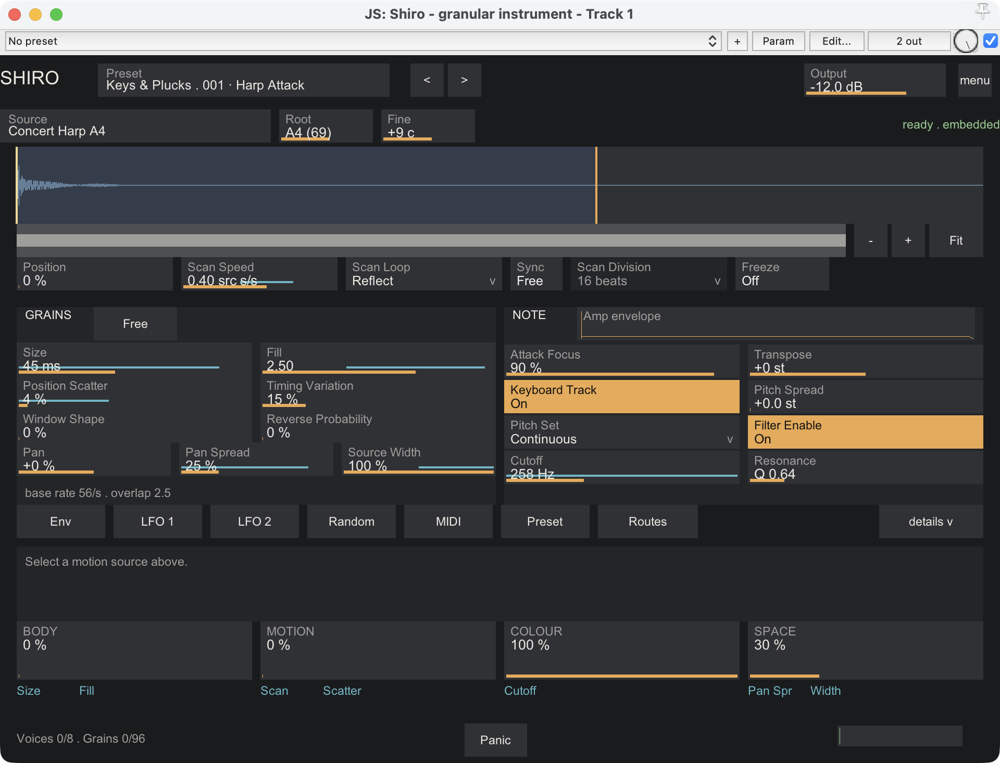
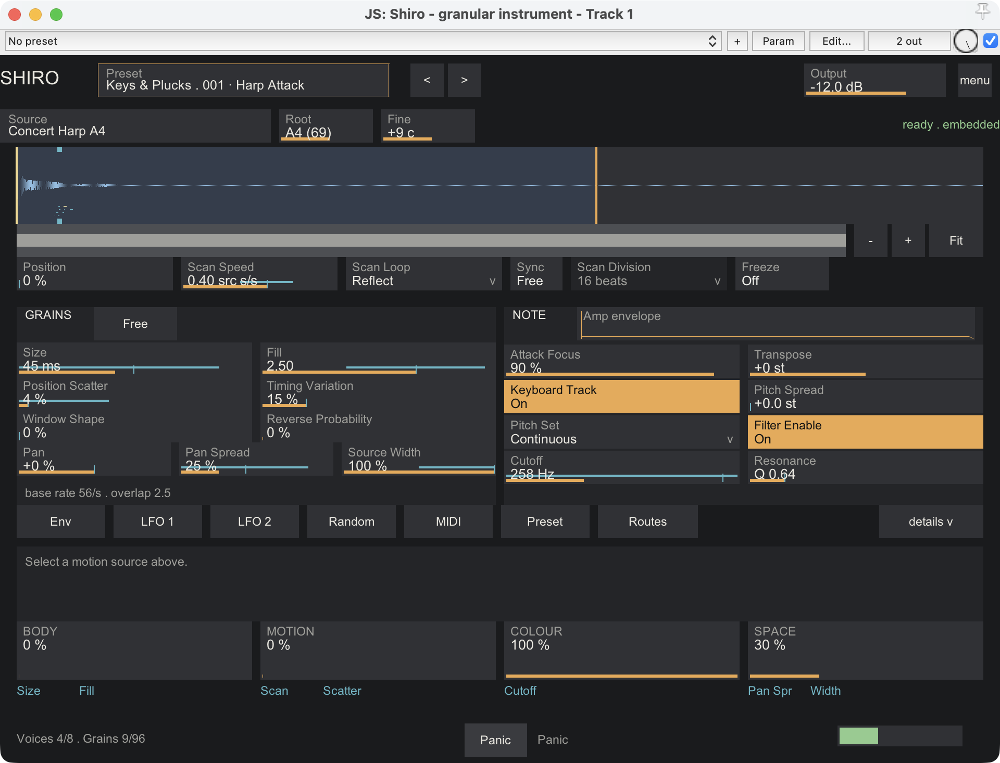
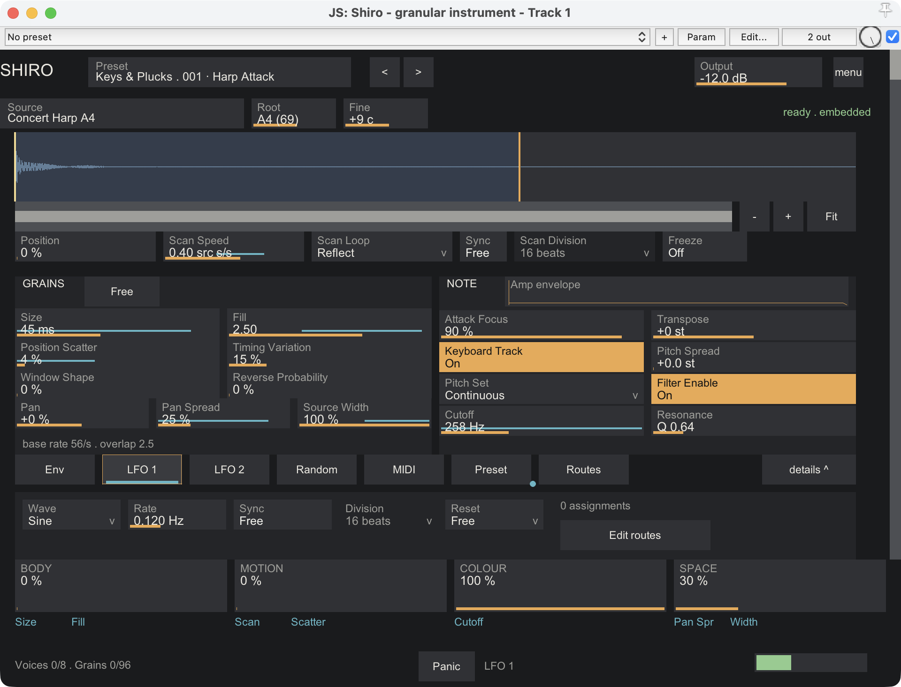
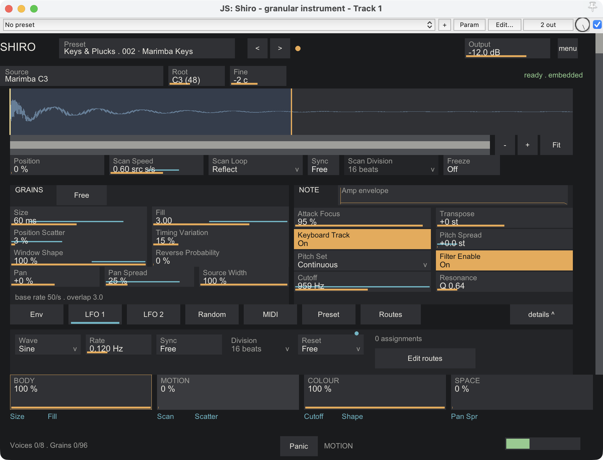
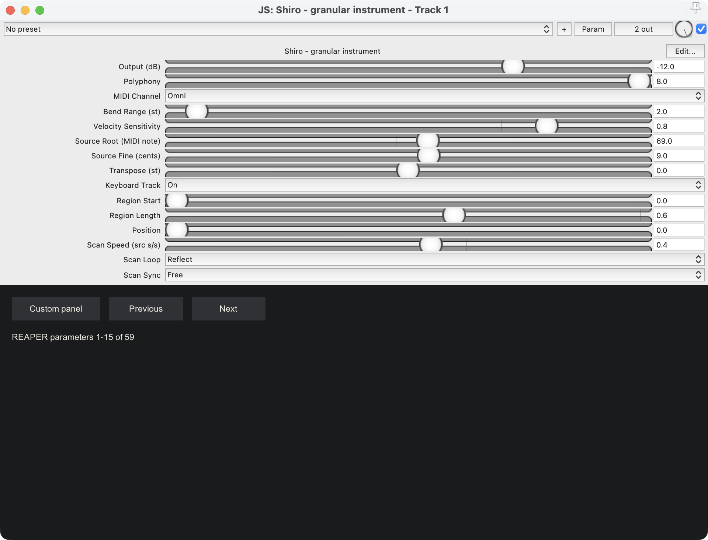
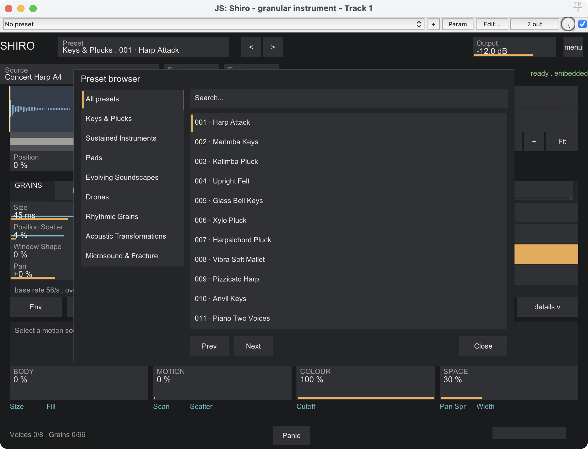
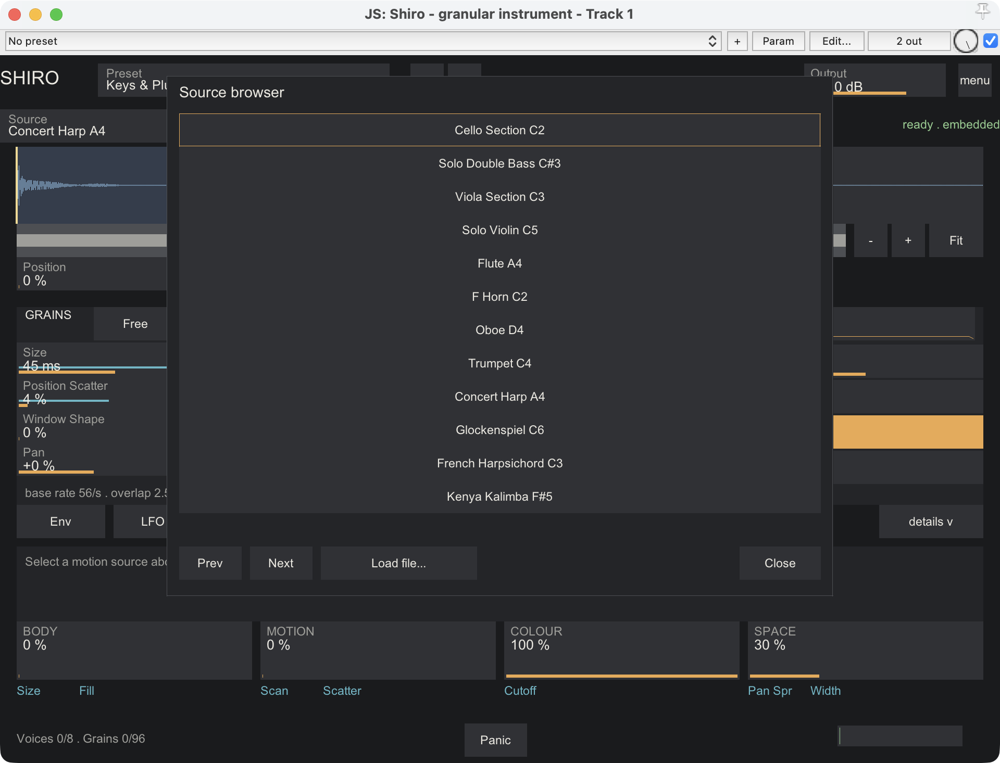
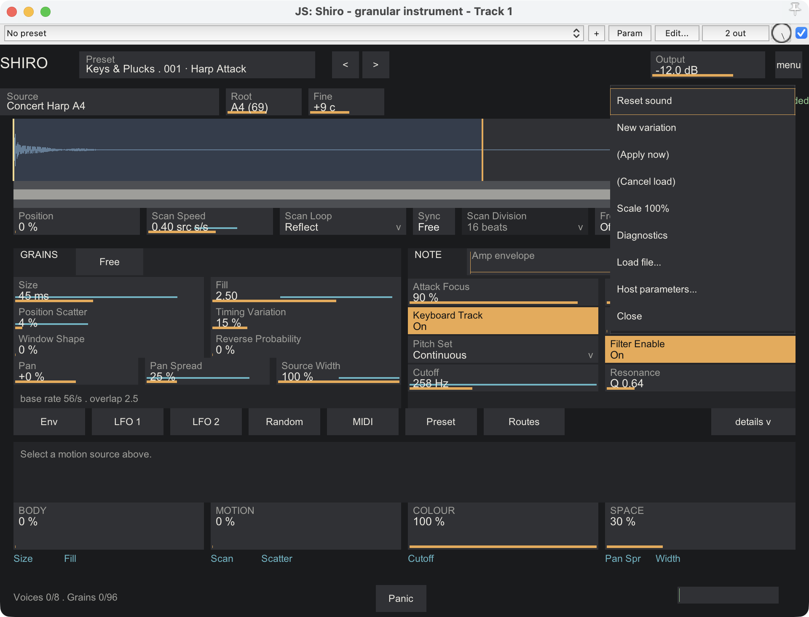

# Shiro — user manual

**Where this build stands.** Shiro is finished and its code is frozen: from here it changes only if something
turns out to be wrong. It was built, measured and played on one machine — an Apple M1 Max Mac running macOS 26
and REAPER 7.8 — where its automated checks pass in full and its author has played it through, preset by preset.
What it has not had: a second pair of ears through the 100 presets, sessions with other musicians, and any
testing on Windows. It has run on one Linux machine, played for an evening rather than tested. So the sound and
the panel are as their author wants them; the range of machines they have met is narrow. If it misbehaves on
yours, that is the report this first release most needs.

Shiro is a REAPER instrument (JSFX) that turns a short recording into something you can play. You give it a
sound of up to twelve seconds, tell it where in that sound to read and how, and it builds every note out of many
small pieces of the recording, called grains. Played with a clear first grain it behaves like a keyboard or a
plucked instrument; slow it down and let its motion sources work and the same note unfolds into a texture that
keeps changing for as long as you hold it.

This manual has three parts: using it, how it is built, and licence and provenance. The preset list is in
`PRESETS.md` and the source credits in `CREDITS.md`; installation instructions come with the download.

## Part 1 — Using it

### The idea in one minute

- **One source.** A recording (mono or stereo WAV, 44.1, 48 or 96 kHz, 20 ms to 12 s). Shiro prepares it once and
  keeps it inside the project, so a saved project plays even if the original file is gone.
- **A region and a position.** You choose which part of the recording is eligible (Region Start / Length) and where
  grains are born inside it (Position). The **scan** moves that birth point through the region over time.
- **Grains.** Each grain reads a short slice of the source (Size, 8 to 500 ms) through a smooth window and plays it
  at the pitch of your MIDI note. **Fill** says how many grains overlap (0.25 to 8), so a long grain can stay
  sparse and a short grain can form a continuous cloud. In **Pulse** mode grains are born on a tempo grid instead.
- **Eight voices, twelve grains each.** A chord never steals grains from another note; the limit is visible in the
  footer (`Grains 28/96`). When a voice's twelve slots are full, the next birth is simply skipped and counted.
- **Motion.** Two shared LFOs, a random walk, a per-note modulation envelope and your MIDI controllers can be routed
  to fourteen destinations through twelve route slots. Four macros — BODY, MOTION, COLOUR, SPACE — sit at the bottom
  of the panel and always mean the same thing across the factory bank.

### Saved-project compatibility

This build reads state versions 1 and 2, including projects saved by earlier test
builds of Shiro. Their embedded source is converted to the current prepared format
without needing the original sample file. New saves use state version 3 and include
the canonical source, its prepared levels, parameters and modulation together.
Use this build or a newer compatible build to reopen new saves; older builds cannot
read version 3. An edit made after recall remains active.

### First steps

1. Put Shiro on a track and arm it for MIDI (or place a MIDI item). The panel opens with factory preset 001.
2. Play. Try a few presets from the preset box in the header (categories on the left of the browser).
3. Move BODY, MOTION, COLOUR and SPACE while holding a chord. The intended directions are fuller BODY, more variable MOTION, brighter or more complex COLOUR, and wider SPACE. An authored starting value can be anywhere in the macro range, including 100%.
4. Load your own recording: drop a WAV on the panel (from the Finder or REAPER's Media Explorer), pick a factory
   source from the source box, or type a path through the menu. Set **Source Root** to the note the recording is
   pitched at, and Shiro tracks the keyboard from there.

### The panel, top to bottom

- **Header**: title, the preset box (`category · NNN name`, click to browse; `<` `>` step through the bank), a dot
  when the patch differs from the preset, and `menu` (Reset sound, Apply now when a replacement is waiting,
  Cancel load while a file is being prepared, Scale up, Scale down, Diagnostics, Load file…, Host parameters…).
- **Changing preset while you play**: the new sound arrives at once and any keys you are holding are re-played on
  it, so a chord carries across instead of being cut off. Your Polyphony and MIDI Channel stay where you set them —
  those are your rig, not part of the sound — but everything else, the seed included, comes from the preset. Each
  preset carries its own seed, so a seed you stepped by hand is replaced when you load another one.
- **Source row**: the source name (click for the source browser; Prev / Next reach all 24 sources; Load file… accepts a typed path), Source Root and
  Source Fine, and the status on the right: `ready · embedded`, `preparing…`, `pending — Apply now` (a replacement
  waits for silence unless you apply it now, which fades the sound out in 5 ms), or an error message. Errors never
  silence the current source.
- **Waveform**: the recording, the region (drag its handles; Alt-drag moves both together; Shift makes either drag ten times finer), the position marker,
  one tick per playing voice where its scan centre is, and up to 48 of the currently sounding grains drawn as spans
  over the part of the recording they read (the exact count is in the footer). Use the −/+ buttons or wheel to zoom; Fit shows the whole recording. Drag the strip below to scroll.
  Zoom buttons also work with Tab and Enter. Grabbing a handle inside its target does not move the region until you drag.
- **Scan row**: Position, Scan Speed (source seconds per second, negative reads backwards; with Sync on only its
  sign matters), Scan Loop (Wrap, Reflect, End Hold), Sync and Scan Division (beats per traversal), Freeze (holds
  every voice's scan centre; grains keep sounding; new notes start at Position).
- **GRAINS**: `free/pulse` switch in the title, Size, Fill (or Pulse Division in pulse mode), Position Scatter,
  Timing Variation, Window Shape (Smooth → Soft → Pluck), Reverse Probability, Pan, Pan Spread, Source Width. The line
  below reads `base rate 56/s · overlap 2.5` (before modulation) and adds `capped` when the 200 grains-per-second ceiling or the 5 ms
  minimum interval is in force.
- **NOTE**: Attack Focus (anchors the first grain of every note at the position with a fast rise: high values give
  clear articulation, low values a soft cloud), Transpose, Keyboard Track, Pitch Spread and Pitch Set (random
  per-grain pitch offsets, continuous or quantised to semitones, octaves or open fifths; the note you play is never
  quantised), the filter (Enable, Cutoff, Resonance) and a small amplitude-envelope strip in the title (click it to
  edit the envelope in the drawer).

- **Motion row and drawer**: `Env`, `LFO 1`, `LFO 2`, `Random`, `MIDI` select a modulation source; the controls it
  drives are outlined and the drawer lists its settings and assignments (`source → destination`, signed depth, `×`).
  `Preset` shows Preset Trim, the description and the seed. The `<` and `>` beside the seed step it by one
  and re-play whatever you are holding on the new value, so you can hear one seed against another under
  the same chord; with nothing held they just change the seed. They are easy to miss: the preset browser
  covers this whole row while it is open, so close the browser first, then open the `Preset` tab.
  `details` expands the drawer.
  The Routes button opens all twelve assignments, including MIDI and macro sources.
  Right-click any modulatable control to assign a source to it: two routes per destination at most, twelve in all.

- **Macros**: four full-width sliders, BODY · MOTION · COLOUR · SPACE; the small chips under each name the
  destinations it drives in this patch.
- **Footer**: `Voices n/8 · Grains n/96` plus the limits engaged since the last frame (drops, pitch, rate, MIDI,
  protect), Panic (5 ms fade of everything), the hint line and an output meter.

Keyboard: Tab / Shift-Tab move between controls, arrows adjust (Shift for fine steps), and Enter edits a number,
activates a button or flips a switch. Open browsers and the menu keep focus within their own controls; Escape
closes an overlay when text entry is not active. Space is reserved for REAPER transport outside text entry.
The default host keyboard routing has been checked; enabling REAPER's “Send all keyboard input to plug-in”
changes host routing, and Shiro does not enable that option automatically. The 59 exposed sound parameters are
available for automation, MIDI learn and host parameter modulation by name; source loading, route editing and
display preferences are separate editor actions.

The panel preserves the selected 100/125/150/200% text scale. Its minimum logical canvas is 800×600; when the
host window is smaller, scrollbars expose the remaining canvas and keyboard focus scrolls into view. At the
minimum size the upper working area has its own scrollbar so the performance macros and footer remain reachable.
The FX window shows the custom panel. Use REAPER’s Param menu and automation lanes to access the host parameters.
Choose `menu → Host parameters…` for REAPER’s native controls. Previous / Next move through four groups (1–15, 16–30, 31–45, 46–59); Custom panel returns here. Paging keeps the return controls reachable on smaller screens. This view changes visibility only, not parameter values or automation identifiers.

### Working with your own sources

Drop a WAV onto the panel from the Finder or from REAPER's Media Explorer, or open the source browser (click the
source name) and choose `Load file…` to type a path. The current source keeps playing while the new one is prepared;
the replacement waits for silence or takes effect at once with `Apply now` (menu or status text).
Path entry accepts typed text; clipboard paste is unavailable in this JSFX interface.

Accepted: PCM WAV, 16/24-bit integer or 32-bit float, mono or stereo, 44.1, 48 or 96 kHz, between 20 ms and
12.000 s. A longer file is refused with "Render an excerpt of 12 seconds or less in REAPER" (record or render the part
you want on another track first). More than two channels are refused; a file that peaks above full scale is
constrained by one gain factor and reported. Everything is stored at 48 kHz inside the project; a 96 kHz original
is band-limited on conversion, a 44.1 kHz original keeps its bandwidth. Saved projects and native presets (REAPER's
own preset menu, `.rpl` exports) embed the prepared audio, so they recall on another machine without the file. A
factory source is CC0 and can be shared inside a project; your own recordings stay yours and Shiro makes no claim
about their rights.

### MIDI

Note on/off with sample-accurate timing; velocity (its effect is set by Velocity Sensitivity); pitch bend per channel
(Bend Range 1–24 semitones); CC1 modulation wheel, channel pressure and polyphonic pressure as modulation sources;
CC11 expression as a volume control independent of Output; CC64 sustain; CC123 releases the channel's notes; CC120
fades that channel in 5 ms; CC121 resets the channel's controllers. MIDI Channel selects Omni or one channel. A
repeated note retriggers its own voice after a 2 ms fade; the ninth simultaneous note steals the oldest voice the
same way. Incoming MIDI is passed through unchanged. Stopping the transport fades all voices; nothing is resumed on
restart. Shiro does not send MIDI and does not implement MPE.

### Limits worth knowing

- 96 grains in total, 12 per voice, 200 grain births per second per voice at most: dense settings can drop births
  (shown as `drops`), which is a design choice, not an error.
- Pitch is clamped at ±36 semitones from the source (`pitch` in the Limit field). Tuned factory sources are meant
  to be played near their root; transposing far shifts formants, as with any sampler.
- Reading beyond a region edge reflects back; very short regions and large transpositions colour the sound.
- Overlapping grains of a very steady source can interfere (louder or softer than expected); the overlap gain
  correction assumes decorrelated material.
- The output protection keeps the signal under full scale with a soft knee; the footer counts when it engages.
  No factory preset depends on it: the bank is calibrated so that ordinary playing, macros and all, stays below that point.
- Latency: PDC0, with no block lookahead. The audio interface buffer, envelope attack, grain-window rise and
  small frequency-dependent delay of the causal filters all contribute to the timing you hear.
- A note on buffer size. At 48 kHz with a 64-sample buffer, a heavily loaded ten-minute test on the development
  Mac produced occasional audio dropouts. The same test with Shiro removed from the project produced them too,
  so they belong to that machine and its audio device, not to Shiro, whose own processing stayed well inside its
  budget throughout. If you work at 48 kHz and hear clicks under heavy load, 128 samples is the safe buffer.

## Part 2 — How it is built

Shiro is one JSFX (`Shiro.jsfx`) with EEL2 include files, no external code:

- `shiro_engine.jsfx-inc` — the audio engine: a fixed memory arena (two source banks, 96 grain records, 8 voice
  records, tables), the scheduler, the grain renderer, envelopes, the per-voice filter, the output stage.
- `shiro_source.jsfx-inc` — source inspection, decoding through REAPER's own file reader (with its resampler when a
  file is not 48 kHz), canonical source storage and four prepared levels used for transposition, waveform overview, the two-bank
  handover between the interface and the audio thread.
- `shiro_state.jsfx-inc` — routes, the full-patch transaction, the factory loader and the saved state (routes,
  trim, description, metadata and the prepared audio as 32-bit floats).
- `shiro_factory.jsfx-inc` — generated tables: 100 presets and 24 source records.
- `shiro_coefficients.jsfx-inc` — fixed preparation and reader tables. `shiro_rate_adapter.jsfx-inc` — MIDI clock conversion and output reconstruction.
- `shiro_tables.jsfx-inc` — supporting tables. `shiro_ui.jsfx-inc` — the panel.

Grains use an eight-tap windowed-sinc reader and prepared, filtered source levels. The source passband extends
to 23.5 kHz, transitions through 23.9 kHz and is suppressed above that boundary. Those suppressed highest partials
remain absent when pitching down. Each grain latches its position, pitch, direction, window shape and stereo placement at birth;
only the voice envelope, the filter, pitch bend and the Voice Pitch destination move a grain after that. Windows
are lookup tables (Smooth, Soft, Pluck and the blends between them) with per-shape energy correction; the first
grain of a note uses a fast-rise window blended in by Attack Focus. Per-voice processing is a two-pole state-variable
low-pass, a linear attack, exponential decay/release amplitude envelope, velocity and expression; the sum passes a
10 Hz DC blocker, preset trim and Output gain, a linear antialias guard, host-rate reconstruction where needed,
then soft-knee protection.

All randomness is seeded: the Variation Seed and the note number decide a note's microgesture, so a repeated note
repeats exactly and a render matches what you heard. The shared LFOs are phase accumulators (a rate change never
jumps the phase). In Transport reset mode, both synced and free-rate LFOs restart at phase zero when
playback starts, resumes or jumps, including loop wrap. Synced periods remain measured in quarter-note
beats through tempo, meter and master-playrate changes. Each start is a fresh gesture: it does not recover
an absolute phase from the song timeline. Free reset preserves the running LFO phase through transport
events. Very small jumps coincident with a tempo or meter change may be indistinguishable from normal
playback at REAPER’s processing-block resolution.

Resources are fixed: 12,582,912 EEL2 slots (96 MiB), 8 voices, 96 grains, 12 routes and an approximately 1 kHz
control clock. At host 96 kHz the core runs at 48 kHz; 44.1 and 48 kHz sessions use their native rate. A
1,024-event input queue and a separate bounded carry queue preserve MIDI timing across host and core intervals.
Nothing adapts sound quality to CPU load: the cost of a sound is the cost of that sound. On the development Mac,
ten-minute runs held at full load — eight voices, all twelve routes, the largest grains — stayed inside the
processing budget the design sets for itself, at 48 kHz with a 64-sample buffer and at 96 kHz with 128.

## Part 3 — Licence and provenance

Factory sources are CC0 1.0 recordings from the Versilian Studios community libraries (VSCO 2 Community Edition and
the Versilian Community Sample Library), prepared to 48 kHz / 24-bit with the sample peak normalised to −1 dBFS (one
recorded gain factor per recording), as described per file in `factory/manifest.json`.
`CREDITS.md` names every recording and its origin; `Licenses/CC0-1.0.txt` is the licence text and
`Licenses/SOURCES-PROVENANCE.md` records where each pool's terms were read and which directories were excluded
because their terms are not CC0. Credit is given although CC0 does not require it. Your own recordings are never
copied anywhere except into your project's saved state.

The Shiro software and documentation are licensed under the MIT License, copyright (c) 2026 Michele Ibba.
The full grant and required notice are in `Shiro/LICENSE` (the `LICENSE` file beside `Shiro.jsfx`). This software
licence does not replace the factory recordings' CC0-1.0 terms. Choosing MIT says nothing about
quality; what has and has not been tested is the note at the top of this manual.
